# merger_prfm

Does pressure-regulated, feedback-modulated star formation (PRFM; Ostriker & Kim 2022) survive a galaxy merger, and what
does it imply for the masses of the star clusters that form? One simulation of two gas-rich dwarf galaxies merging
(4 Msun gas and star particles, 0.4 pc softening, magnetic fields, resolved supernovae), 226 Myr through three pericentre
passages to the final coalescence.

Three parts, kept apart. **A**: what the simulation shows, figures with what is plotted and the numbers. **B**: a
semi-empirical model, one set of equations with constants calibrated on the run, and the tests it passes and fails.
**C**: the closed calculation from the layer state to the cluster mass function, which does not exist yet.

## Status of the PRFM comparison

Reference: the Ostriker & Kim (2022) calibration. The run's own undisturbed disc lasts only from 25 to 40 Myr, since the
first 25 Myr are the isothermal initial state relaxing and the discs are tidally disturbed from the first passage on.

| | before 1st passage | 1st to 2nd | 2nd to 3rd | 3rd to coalescence |
|---|---|---|---|---|
| P over W, layer 1 kpc deep | 1.05 | 0.94 | 0.73 | 0.96 |
| pressure per unit SFR over the yield, 10 Myr SFR | 1.9 | 1.7 | 37 | 2.5 |
| same, 40 Myr SFR as in OK22 | 0.6 | 1.6 | 2.5 | 9.4 |
| SFR at fixed weight vs OK22, 0.5 kpc columns (dex) | -0.5 | -0.6 | -1.8 | -2.2 |
| same, 0.25 kpc columns (dex) | -0.2 | -0.5 | -1.6 | -2.1 |

Durations. Pressure over weight leaves 0.7 to 1.4 for 24 % of the run (97 to 141 Myr and short episodes at the later
pericentres) and never leaves 0.5 to 2. The pressure per unit star formation exceeds 3 times the yield for 34 % of the run
with the 40 Myr rate (107 to 125 and 158 to 207 Myr) and 10 times for 20 %; its time-median over the whole run is 1.9.

Reading. Vertical balance survives the merger, with one interval of moderate shortfall around the second passage during
which the gas is not a layer in any orientation. The supply of that pressure by star formation does not survive: after the
second passage the layer holds 10 to 100 times more pressure per unit star formation than feedback yields, and that pressure
is turbulent and magnetic, sustained by the shear of the merger flow at a fixed coefficient of 0.02. The star formation rate
at fixed weight falls below the OK22 relation by 0.5 dex in the discs and 2 dex after the second passage, at every column
size. The balance test itself is meaningful only for columns at least 1 kpc deep and within about 30 degrees of the disc
normal; the yield and rate comparisons depend on neither.

---
---
# Part A. What the simulation shows

## Definitions used by every figure

**Columns.** For each galaxy a $12\times12$ grid of columns of side $L = 0.5$ kpc is laid in the plane perpendicular to the
gas angular-momentum vector measured within 2 kpc of the galaxy centre; the centre is the median position of that galaxy's
initial stellar disc particles (membership by particle ID). One grid, centred between the two centres with the angular
momentum within 3 kpc, replaces the two whenever the centres are closer than 0.5 kpc. A *full column* spans
$|z| < 1.5$ kpc about the grid plane; a *layer column* spans $|z - z_{\rm mid}| < 0.5$ kpc about the midplane of that
column measured in the full-column run. Only columns with $\Sigma_{\rm gas} > 1\ {\rm M_\odot\,pc^{-2}}$ are used, and
before the second passage only columns in which less than 10 % of the gas belongs to the other galaxy by particle ID.

**Gas quantities per column.** Sums run over the gas particles $i$ inside the column (footprint $A = L^2$), with mass
$m_i$, height $z_i$ along the column normal $\hat n$, velocity $\mathbf v_i$, density $\rho_i$, specific internal energy
$u_i$, temperature $T_i$ and magnetic field $\mathbf B_i$. "2p" denotes particles with $T_i < 2\times10^4$ K.

$$\Sigma_{\rm gas} = \frac{1}{A}\sum_i m_i, \qquad
z_{\rm mid} = \frac{\sum_i m_i z_i}{\sum_i m_i}, \qquad
H = \left[\frac{\sum_i m_i (z_i - z_{\rm mid})^2}{\sum_i m_i}\right]^{1/2}$$

The *slab* is $|z_i - z_{\rm mid}| < h_s$ with $h_s = \max(25\ {\rm pc},\ 0.25\,H)$ and volume $V_s = 2 h_s A$.
With $v_{n,i} = (\mathbf v_i - \mathbf v_{\rm gal})\cdot\hat n$, $\mathbf v_{\rm gal}$ the mean velocity of the galaxy's
stellar particles within 1.5 kpc of its centre, and $\bar v_n$ the mass-weighted mean of $v_{n,i}$ over the 2p slab
particles:

$$P_{\rm th} = \frac{1}{V_s}\sum_{i\in{\rm slab,2p}} m_i(\gamma-1)u_i,\qquad \gamma = 5/3$$

$$P_{\rm turb} = \frac{1}{V_s}\sum_{i\in{\rm slab,2p}} m_i\,(v_{n,i}-\bar v_n)^2$$

$$\Pi_{\rm mag} = \frac{1}{V_s}\sum_{i\in{\rm slab,2p}} \frac{m_i}{\rho_i}\,\frac{B_i^2 - 2B_{n,i}^2}{8\pi},
\qquad B_{n,i} = \mathbf B_i\cdot\hat n$$

$$P_{\rm mag} = \frac{1}{V_s}\sum_{i\in{\rm slab}} \frac{m_i}{\rho_i}\,\frac{B_i^2}{8\pi}$$

$$P_{\rm tot} = P_{\rm th} + P_{\rm turb} + \Pi_{\rm mag}, \qquad
\rho_{\rm mid} = \frac{1}{V_s}\sum_{i\in{\rm slab,2p}} m_i$$

$\Pi_{\rm mag}$ is the vertical Maxwell stress, the magnetic term that supports the layer against its weight (it can be
negative); $P_{\rm mag}$ is the magnetic pressure and is used only for the field strength and the equipartition
comparison. All pressures are quoted as $P/k_{\rm B}$ in K cm$^{-3}$; code units ${\rm M_\odot\,(km/s)^2\,kpc^{-3}}$
convert with the factor $4.90\times10^{-6}$, and the magnetic terms are computed in erg cm$^{-3}$ and divided by
$k_{\rm B}$.

**Weight.** With $g_{n,i} = \mathbf g_i\cdot\hat n$ the gravitational acceleration along the normal at particle $i$,

$$\mathcal W = \frac{1}{2A}\left[\sum_{z_i > z_{\rm mid},\,2p} m_i\,(-g_{n,i}) \;+\; \sum_{z_i < z_{\rm mid},\,2p} m_i\,g_{n,i}\right],$$

the mean of the weight of the gas above the midplane and of that below, each the integral of $\rho\,g_n$ through its half
of the column. $\mathbf g_i$ comes from a particle-mesh solve of all gas, stars and dark matter on a $512^3$ grid over
$\pm4$ kpc nested in a $512^3$ grid over $\pm32$ kpc (median error 8 % against direct summation on 64 test particles per
snapshot).

**Star formation rate.** Over the stars in the column that formed during the run (the initial stellar particles are
excluded),

$$\Sigma_{\rm SFR,10} = \frac{1}{A\,(10\ {\rm Myr})}\sum_{{\rm age}<10\,{\rm Myr}} m_\star, \qquad
\Sigma_{\rm SFR,40} = \frac{1}{A\,(40\ {\rm Myr})}\sum_{{\rm age}<40\,{\rm Myr}} m_\star,$$

in ${\rm M_\odot\,yr^{-1}\,kpc^{-2}}$; $M_{\rm young} = \sum_{{\rm age}<10\,{\rm Myr}} m_\star$ is the same sum without
the division.

**Ostriker & Kim (2022) relations used.**

$$\Upsilon_{\rm tot}(P) = 10^{-0.212\log_{10}P + 3.86}\ {\rm km\,s^{-1}}\ \ ({\rm eq.\ 26c}),\qquad
\Sigma_{\rm SFR}(\mathcal W) = 10^{1.17\log_{10}\mathcal W - 7.32}\ \ ({\rm eq.\ 28b}),\qquad
\Sigma_{\rm SFR}(P) = 10^{1.18\log_{10}P - 7.43}\ \ ({\rm eq.\ 28a}),$$

with $P$, $\mathcal W$ in K cm$^{-3}$ and $\Sigma_{\rm SFR}$ in ${\rm M_\odot\,yr^{-1}\,kpc^{-2}}$. A pressure per unit
star formation rate in K cm$^{-3}$ per ${\rm M_\odot\,yr^{-1}\,kpc^{-2}}$ is converted to km s$^{-1}$ by dividing by
$4.81\times10^3$.

**Group finding.** Friends-of-friends: two particles are linked if their separation is below the linking length $l$; a
group is a connected component of the link graph; groups with fewer than $N_{\min} = 25$ particles are discarded (every
gas and star particle has 4 M$_\odot$, so $N_{\min}$ = 100 M$_\odot$). Clusters: stars younger than 10 Myr, $l = 5$ pc.
Clouds: gas with $T < 1000$ K and $n_{\rm H} > 10$ cm$^{-3}$, $l = 3$ pc. Clumps: gas with $n_{\rm H} > 100$ cm$^{-3}$,
$l = 1.5$ pc. Group finding is repeated independently on each snapshot used; nothing is tracked between snapshots except
the clump lineages described under Clouds. Per group, with sums over members,

$$M = \sum_i m_i,\qquad \mathbf x_{\rm com} = \frac{\sum_i m_i \mathbf x_i}{M},\qquad
\mathbf v_{\rm com} = \frac{\sum_i m_i \mathbf v_i}{M},\qquad r_h:\ \ M(<r_h) = M/2 \text{ about } \mathbf x_{\rm com}.$$

**Boundedness of clusters.**

$$E_{\rm kin} = \tfrac12\sum_i m_i\,|\mathbf v_i - \mathbf v_{\rm com}|^2,\qquad
E_{\rm pot} = -G\sum_{i<j}\frac{m_i m_j}{\sqrt{r_{ij}^2+\epsilon^2}},\qquad \epsilon = 1\ {\rm pc},$$

summed over the group's own members only (no external potential, no tidal term); a cluster is *bound* if
$E_{\rm kin} + E_{\rm pot} < 0$. Groups with more than 40 000 members are not energy-tested and, together with any group
of $r_h > 20$ pc, are flagged as the nucleus and excluded. Clouds and clumps are not energy-tested; their boundedness
enters only through $\alpha_{\rm vir}$ as defined under Clouds.

**Robustness of the cluster catalogue.** The cluster mass function was recomputed with linking lengths of 3, 5 and 8 pc,
with minimum group sizes of 10, 25 and 50 particles, with and without the intruder cut, and for all groups against bound
groups only. The maximum-likelihood index above 300 M$_\odot$ changes by at most 0.05 with the linking length (per phase
1.91/1.92/1.90, 1.82/1.82/1.79, 1.79/1.77/1.76, 1.58/1.61/1.61 for 3/5/8 pc), by 0.04 with the intruder cut, and by 0.06
between all and bound groups. The minimum group size sets only the completeness limit: the 10- and 25-particle catalogues
contain the same groups above 100 M$_\odot$, and the 50-particle catalogue is incomplete below 200 M$_\odot$. The bound
fraction of groups between 100 and 300 M$_\odot$ falls from 0.7 before the second passage to 0.35 after the third, which is
why the mass function is quoted from 300 M$_\odot$ up; above 1000 M$_\odot$ more than 73 % of groups are bound in every
phase.

**Time-series statistic.** Where a figure shows one value per snapshot from many columns, it is the
$\Sigma_{\rm gas}$-weighted median over the columns: the value $r$ for which
$\sum_{c:\,r_c\le r}\Sigma_{{\rm gas},c} = \tfrac12\sum_c \Sigma_{{\rm gas},c}$.

**Phases.** 25 to 40 Myr (before the first passage), 40 to 110, 110 to 169, 169 to 226 Myr, split at the pericentres 40,
110, 169 Myr; the final coalescence is at 217 Myr. The first 25 Myr are excluded (isothermal initial state relaxing).

## Merger phases
x: time since the start of the run. y: $d(t) = |\mathbf c_A - \mathbf c_B|$, with $\mathbf c_X$ the median position of the initial
stellar disc particles of galaxy X (galaxy A: particle IDs $\le 26\,000\,000$). Dotted lines: pericentres at 40, 110, 169 Myr; solid: final
coalescence at 217 Myr.

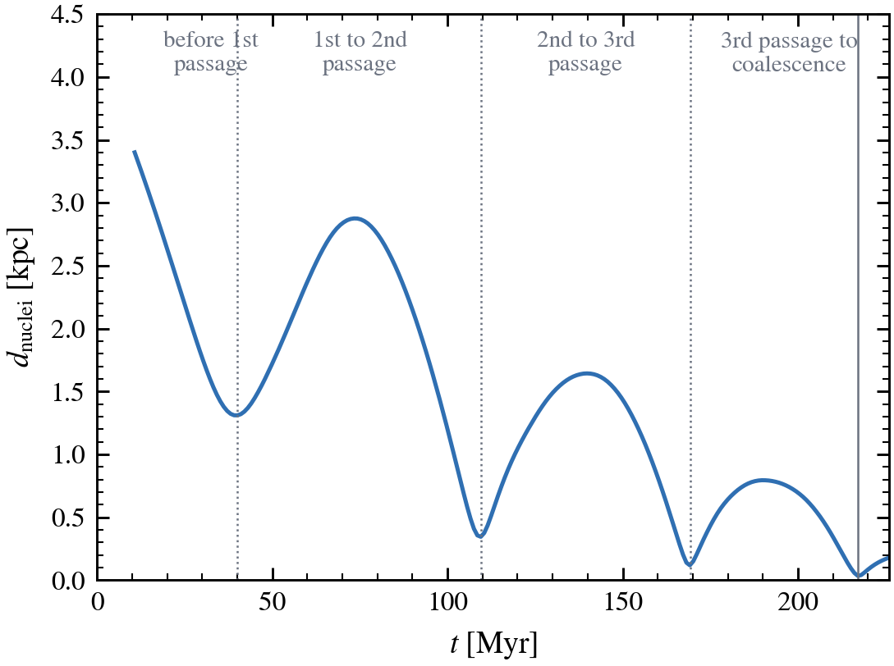

## Vertical equilibrium
x: time. y, per snapshot: the $\Sigma_{\rm gas}$-weighted median over the clean columns $c$ of $r_c = P_{{\rm tot},c}/\mathcal W_c$. Light: full columns (|z| < 1.5 kpc about the grid plane); dark:
layer columns (|z − z_mid| < 0.5 kpc), with P_tot and W as defined above in both cases. Result: layer 1.05, 0.94, 0.73, 0.96
in the four phases, never outside 0.5 to 2; the full column drops to 0.4 between the second and third passage because it
then includes the dark-matter weight of gas streaming outside the layer.

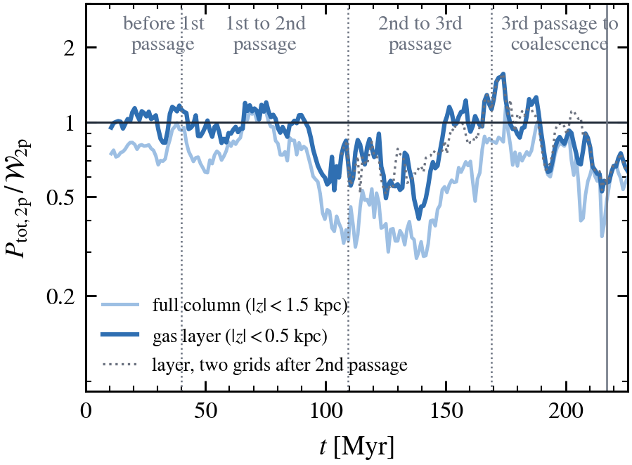

## Pressure per unit star formation
x: time. y, per snapshot, with $c$ running over the clean layer columns of that snapshot:

$$y = \frac{\sum_c P_{{\rm tot},c}}{\sum_c \Sigma_{{\rm SFR,10},c}}\;\Big/\;4.81\times10^{3}\quad[{\rm km\,s^{-1}}],$$

the pressure the layer holds per unit star formation rate, the quantity Ostriker & Kim call the yield. Dashed:
$\Upsilon_{\rm tot}(\bar P)$ at $\bar P = \sum_c \Sigma_{{\rm gas,2p},c}P_{{\rm tot},c}/\sum_c \Sigma_{{\rm gas,2p},c}$. Result: within a factor of 2 of the yield before the second passage, 10 to 100 times above it
in the quiet intervals after, back to the yield during the two nuclear bursts.

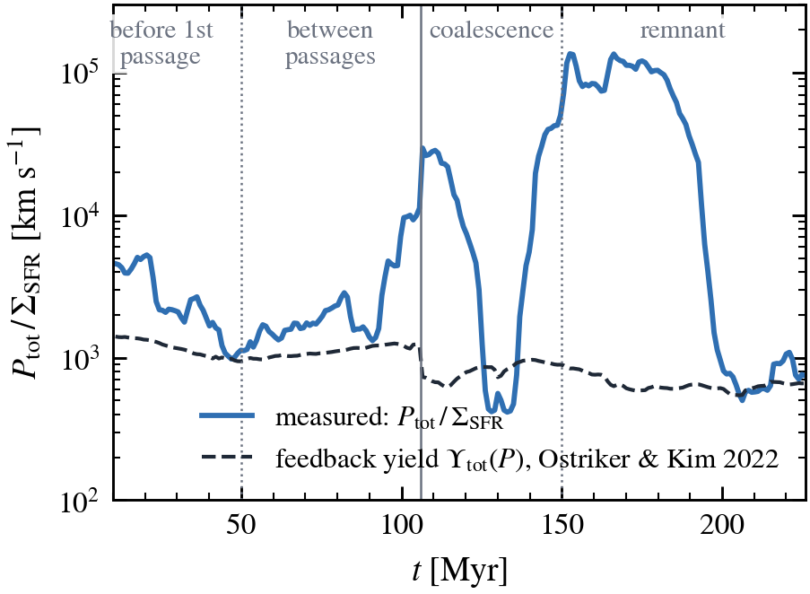

## Magnetic field
x: time. y: $B_c = (8\pi k_{\rm B} P_{{\rm mag},c})^{1/2}$ per layer column, in $\mu$G. Dark:
$\sum_c \Sigma_{{\rm gas},c} B_c / \sum_c \Sigma_{{\rm gas},c}$ over the clean columns; light: the median of $B_c$.
Result: 10 nG seed, e-folding time 10 Myr, 1 to 2 microgauss from 50 Myr, a factor 5 jump at the second passage, 10 to 20
microgauss after the third.

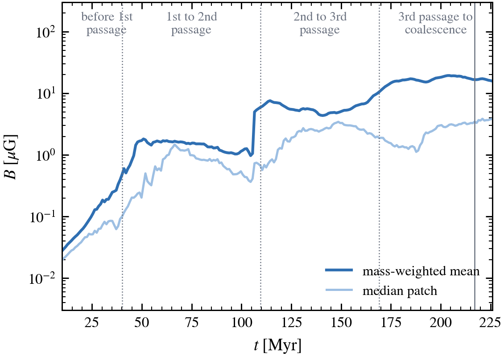

## Pressure shares
x: time. y, per snapshot with $c$ over the clean layer columns: $\sum_c P_{{\rm th},c}/\sum_c P_{{\rm tot},c}$,
$\sum_c P_{{\rm turb},c}/\sum_c P_{{\rm tot},c}$ and $\sum_c \Pi_{{\rm mag},c}/\sum_c P_{{\rm tot},c}$, which sum to one;
dashed: $\sum_c P_{{\rm mag},c}/\sum_c P_{{\rm tot},c}$, the magnetic pressure relative to the total support, not part of the sum.
Result: the Maxwell stress is below 5 % of the support before the second passage, 20 % between the second and third, and
25 to 45 % from the third passage to coalescence; the magnetic pressure itself equals the total support at the second
passage and exceeds it after the third, i.e. the field is at or above equipartition even though only part of it supports
the layer vertically.

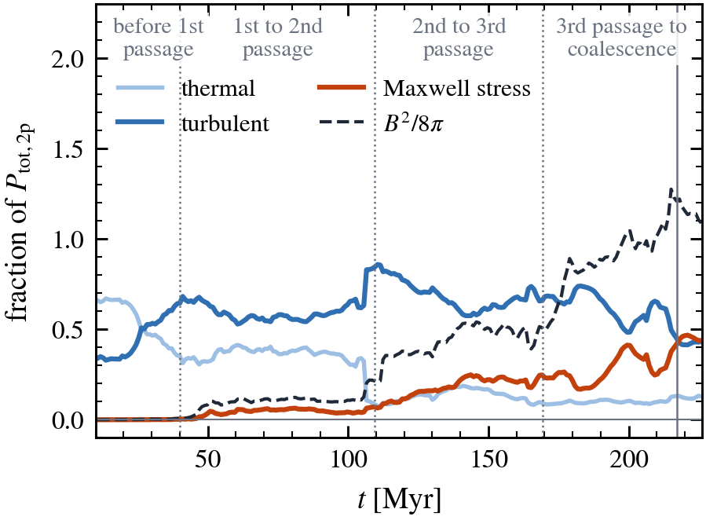

## Clouds
*Clouds* and *clumps* are the friends-of-friends groups of cold gas defined above (l = 3 pc at n_H > 10 cm⁻³, l = 1.5 pc
at n_H > 100 cm⁻³, N ≥ 25), on every tenth snapshot, over the whole box.
Stars carry the ID of the gas particle they formed from, so the stars formed from a cloud's members are counted exactly.
Per cloud, with $M$, $\mathbf x_{\rm com}$, $\mathbf v_{\rm com}$, $r_h$ as defined above,

$$\sigma_{\rm 3d}^2 = \frac{\sum_i m_i|\mathbf v_i-\mathbf v_{\rm com}|^2}{M},\qquad
\alpha_{\rm vir} = \frac{5\,(\sigma_{\rm 3d}^2/3)\,r_h}{G\,M},\qquad
v_A^2 = \frac{1}{N}\sum_i \frac{B_i^2}{4\pi\rho_i}.$$

Cloud mass function. x: $M$. y: $N_k/(N_{\rm phase}\,\Delta M_k)$, the number of clouds in mass bin $k$ divided by the bin
width and by the total number of clouds in the phase; error $\sqrt{N_k}/(N_{\rm phase}\Delta M_k)$. Dashed: M^-1.6. Result: identical in all four phases
(maximum-likelihood index above 300 Msun 1.57 to 1.60); only the largest cloud grows, 3 × 10⁵ to 10⁷ Msun.

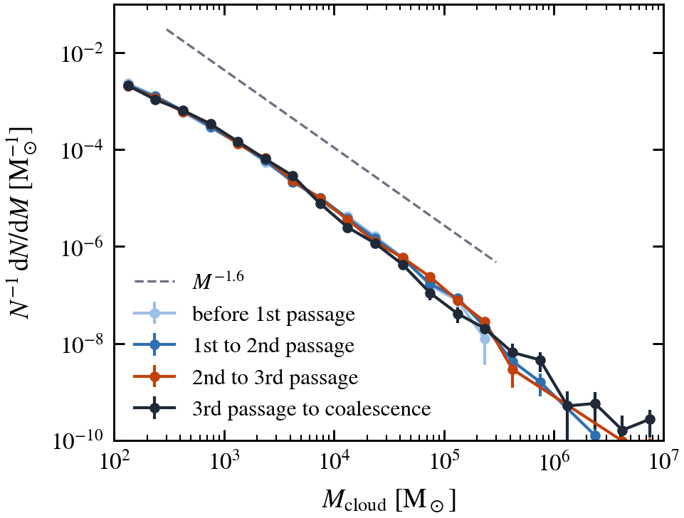

Efficiency. Clumps are linked from snapshot k to k+1 when each is the other's largest member overlap; a chain of such links
is a lineage. For a lineage with clumps at snapshots $k = k_0\ldots k_1$: $M_\star(k)$ = mass of stars formed between snapshots $k$
and $k+1$ whose parent gas particle was a member at $k$; $M_{\star,10}(k_1)$ = the same over the 10 Myr after $k_1$;

$$\epsilon_{\rm int} = \frac{\sum_{k<k_1} M_\star(k) + M_{\star,10}(k_1)}{\max_k M(k)}.$$ The pre-onset snapshot is the last k before M_*(k) > 0
(or k_0 if stars form at once). x: alpha_vir at the pre-onset snapshot. y: epsilon_int. Points: lineages with
max_k M(k) ≥ 300 Msun, k_0 after 5 Myr, k_1 before 221 Myr; lines: medians per alpha bin per phase, phase by onset time.
Result: about 5 % for alpha below 2 to 4, 0.1 % above 10; the fraction of clumps below the threshold falls from 0.9 to 0.06
across the run.

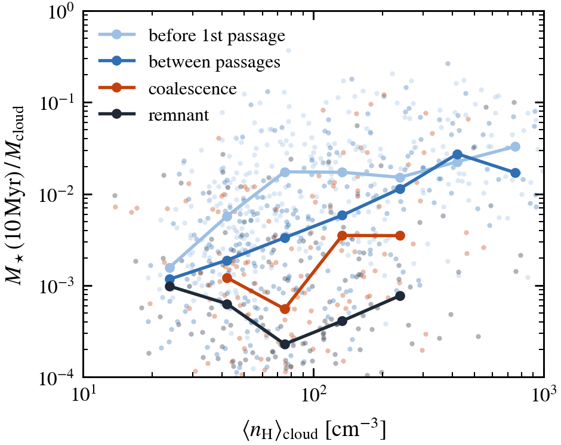

## Cluster mass function
*Clusters*: the friends-of-friends groups of stars younger than 10 Myr defined above (l = 5 pc, N ≥ 25), on every tenth
snapshot, kept if bound by the energy criterion above, not the nucleus, and lying in a clean column.
x: cluster mass. y: $N_k/\Delta\log M_k$ per phase, error $\sqrt{N_k}/\Delta\log M_k$. Lines: the maximum-likelihood
power law $dN/dM\propto M^{-\alpha}$ above 300 M$_\odot$,

$$\alpha = 1 + \frac{N}{\sum_{M_i\ge300}\ln(M_i/300)},$$

drawn over the fitted range. Result: alpha = 1.92, 1.77, 1.74, 1.52; largest cluster
6.7 × 10³, 2.0 × 10⁴, 2.8 × 10⁴, 1.0 × 10⁵ Msun. Below 300 Msun after the second passage only a third of the groups are
bound, so the function is quoted from 300 Msun up.

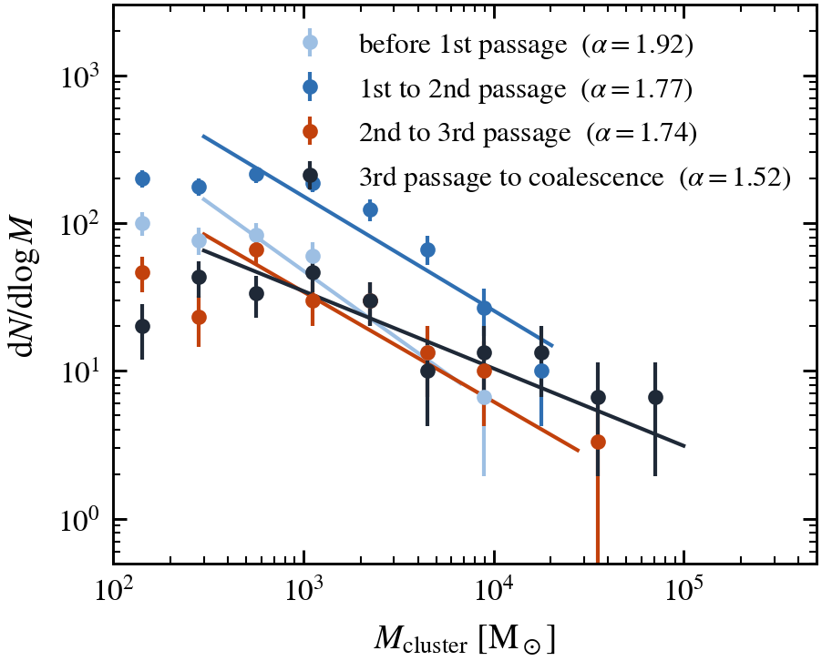

## Largest cluster per burst
x: $M_{{\rm young},c}$ of a full column $c$ (definition above). y: $M_{\max,c}$, the mass of the most massive bound
cluster whose centre lies in column $c$. Clean columns with M_young > 500 Msun and at least one bound cluster,
every tenth snapshot. Line: median of M_max per M_young bin; red: M_max = 0.5 M_young; dotted: M_max = M_young. Result:
the median follows half the young mass up to 10⁵ Msun; the nuclear bursts above that split their stars over several
clusters.

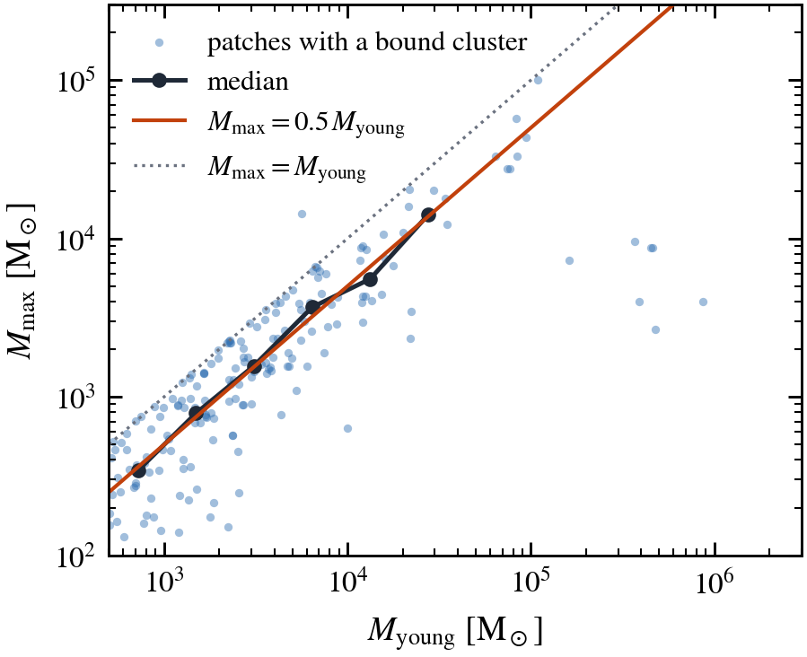

## Every cluster against its patch
Each bound cluster of the clean sample against the column it lies in (of the two grids, the one in which that column's
intruder fraction is lower). Left x: layer W_c. Middle x: layer P_tot,c. Right x: Sigma_SFR,10,c. y: cluster mass.
Dashed lines: $0.5\,\Sigma_{\rm SFR}(\mathcal W)\,A\,\tau$, $0.5\,\Sigma_{\rm SFR}(P)\,A\,\tau$ and
$0.5\,\Sigma_{\rm SFR,10}\,A\,\tau$ with the OK22 relations above, $A = 0.25$ kpc$^2$ and $\tau = 10^7$ yr: half the stars a column forms in 10 Myr at the OK22 rate for its weight, for its
pressure, and at its own rate. Result: cluster masses fill two decades below the lines; 9 % lie above the weight line.

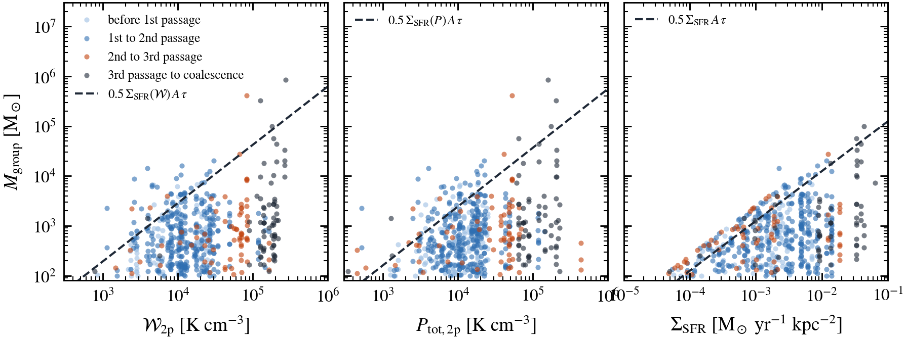

## Line of sight
As the vertical-equilibrium figure with the column normal replaced by $\hat n_\theta = \cos\theta\,\hat n + \sin\theta\,\hat e_2$,
$\theta = 0, 30, 60, 90$ degrees, $\hat e_2$ the second in-plane axis of the grid. Each θ has its own full-column run and its own layer cut about the
midplane found along n̂_θ. y: the Sigma_gas-weighted median of layer P_tot / W over the columns, computed per grid and
combined over the two grids with weights equal to their column counts. Every fourth snapshot. Result: before the second
passage θ = 0 gives one and θ = 30 gives 0.4 to 0.7; between the second and third passage all θ give 0.6 to 1.2; after the
third all θ give 0.9 to 1.3.

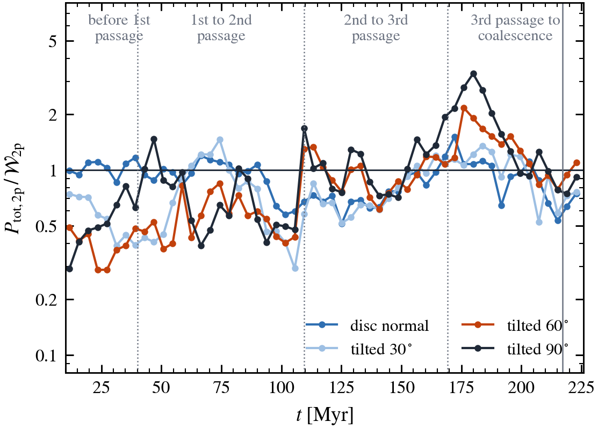

## Column size
x: column depth $2z_{\rm col}$: 3 kpc (full column, about the grid plane) or 1, 0.5, 0.25 kpc ($z_{\rm col}$ = 0.5, 0.25,
0.125 kpc about the midplane of the 0.5 kpc reference column the point falls in). Marker: footprint side $L$ = 0.5, 0.25,
0.125 kpc (grids of $12^2$, $24^2$, $48^2$ columns over $\pm3$ kpc), $A = L^2$. y: for each configuration, the median over the snapshots of the phase (every
fourth snapshot) of r(t), the per-snapshot Sigma_gas-weighted median of P_tot / W. Shaded: 2H. Result: r depends on the
depth only; L from 0.5 to 0.125 kpc at fixed depth changes nothing, depths of 0.5 and 0.25 kpc give 1.5 and 2.7.

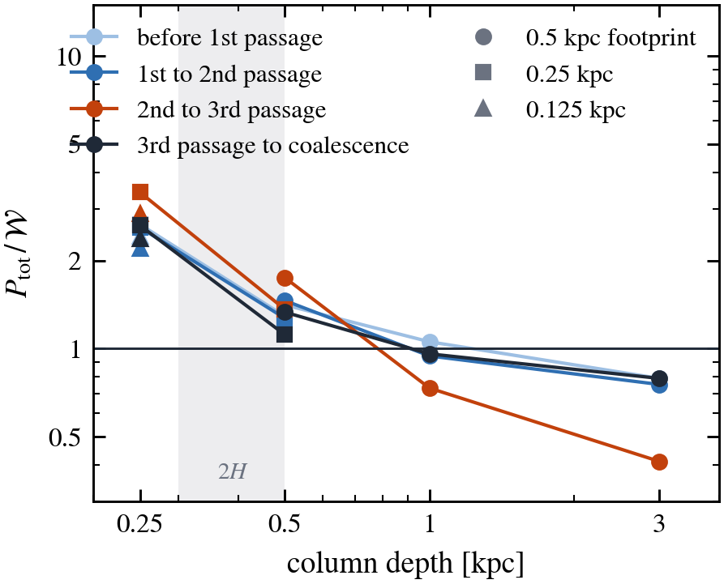

## Low-mass end of the cluster mass function
x: cluster mass bin $[M_1, M_2)$. y: the $\alpha$ maximising

$$\mathcal L(\alpha) = -\alpha\sum_i \ln M_i - N\ln\frac{M_1^{\,1-\alpha} - M_2^{\,1-\alpha}}{\alpha-1}$$

over the $N$ groups with $M_i$ in the bin, on a grid $\alpha = 0.2\ldots4$; error from the curvature of $\mathcal L$ at the
maximum. Filled: all friends-of-friends groups of the 10-particle catalogue (5 pc linking); open: bound ones only; per
phase, every tenth snapshot. Result: above 300 Msun bound and all agree within the errors; in the 100 to 300 Msun bin
after the second passage the bound-only index collapses because only a third of those groups are bound.

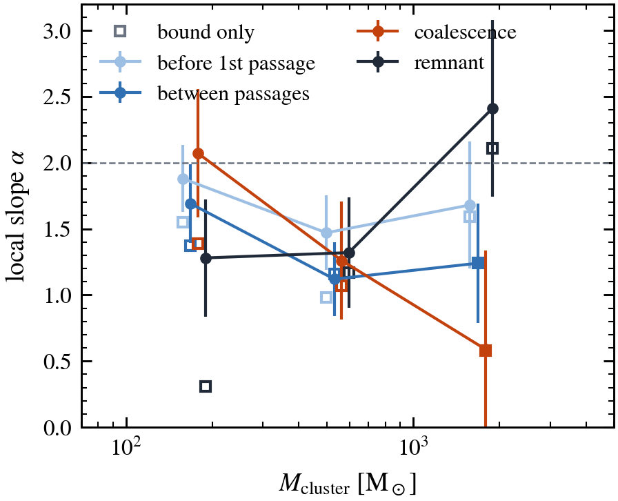

---
# Part B. The model

## Functional form

Inputs per 0.5 kpc patch: layer weight $\mathcal{W}$, midplane density $\rho_{\rm mid}$, scale height $H$, effective
dispersion $\sigma_{\rm eff} = (P/\rho_{\rm mid})^{1/2}$ with $P = \mathcal{W}$. Inputs per cold complex: mass $M$,
half-mass radius $r_h$, Alfvén Mach number $\mathcal{M}_A$.

**(1) Complex population.** Measured, invariant through the merger:
$$n(M)\,{\rm d}M \propto M^{-1.6}\,{\rm d}M \quad (M > 300\ {\rm M}_\odot),$$
with the top rising from $10^5$ to $10^7$ Msun through the merger.

**(2) Virial parameter of a complex from the layer.**
$$\alpha_{\rm tot}(M, r_h, \sigma_{\rm eff}) = \frac{5}{3}\,\frac{\sigma_{\rm eff}^2\,(r_h/H)\,r_h}{G\,M}\,\left(1 + \mathcal{M}_A^{-2}\right).$$
Measured over predicted: median 0.9, 0.4 dex scatter, rank correlation 0.8.

**(3) Efficiency of a complex.** A step in $\alpha_{\rm tot}$ with lognormal scatter:
$$\epsilon(\alpha_{\rm tot}) = \epsilon_u + \frac{\epsilon_b - \epsilon_u}{1 + (\alpha_{\rm tot}/\alpha_c)^m},\qquad
\log\epsilon \sim \mathcal{N}\big(\log\epsilon(\alpha_{\rm tot}),\ s\big).$$

| parameter | dense clumps (n > 100) | complexes (n > 10) |
|---|---|---|
| $\epsilon_b$ (bound) | 0.050 | 0.022 |
| $\epsilon_u$ (unbound) | 0.0012 | 0.0017 |
| $\alpha_c$ | 4.0 | 5.9 |
| $m$ | 4.7 | 3.1 |
| $s$ (dex) | 0.69 | 0.71 |

**(4) Stars to clusters.** The dominant cluster of a complex takes $f_c = 0.5$ of its stars; secondary clusters steepen the
mass function by about 0.2.

**(5) Cluster mass function.** The complex mass function convolved with the efficiency distribution:
$$n_{\rm cl}(M_{\rm cl}) = \int {\rm d}M\ n(M)\ \frac{1}{f_c M}\ p_\epsilon\!\left(\frac{M_{\rm cl}}{f_c M}\ \Big|\ \alpha_{\rm tot}(M,\sigma_{\rm eff})\right),$$
with $p_\epsilon$ the lognormal of (3) centred on the step. Evaluated on the measured complexes of each phase (200 draws):

| phase | $\sigma_{\rm eff}$ [km/s] | bound fraction | slope pred. | slope meas. | top pred. | top meas. |
|---|---|---|---|---|---|---|
| before 1st passage | 8.7 | 0.37 | 2.02 ± 0.13 | 1.92 | 6.9e3 | 6.7e3 |
| 1st to 2nd passage | 9.4 | 0.11 | 1.93 ± 0.06 | 1.77 | 1.9e4 | 2.0e4 |
| 2nd to 3rd passage | 18.3 | 0.05 | 1.85 ± 0.07 | 1.74 | 1.3e5 | 2.8e4 |
| 3rd passage to coalescence | 19.3 | 0.02 | 1.61 ± 0.07 | 1.52 | 2.8e5 | 1.0e5 |

The slope is 0.1 to 0.2 too steep in every phase; the flattening (0.40 vs 0.40) and the rise of the top (45 vs 15) are
reproduced. With the mass dependence of boundedness removed (bound flags shuffled) the slopes are 2.21, 2.26, 1.98, 1.83.

**(6) Largest cluster per interval.** Two equivalent statements: $M_{\max} \simeq 0.1\,M_{\star}(25\,{\rm Myr})$, the
largest burst of the interval; and, while star formation is on, $M_{\max} \simeq f_c\,\eta\,\Sigma_{\rm SFR}^{\rm PRFM}(\mathcal{W}_{90})\,A\,\tau$
with $\eta = 0.4$, $A = 0.25$ kpc$^2$, $\tau = 10$ Myr, slope 0.94 and 0.09 dex scatter over seven intervals.

**(7) Patch-level duty cycle** (used for the burst-mass mock of Part B above):
$P({\rm burst}\,|\,\rho_{\rm mid}) = [1 + \exp(-k(\log\rho_{\rm mid} - \log\rho_{50}))]^{-1}$, $k = 5.1$,
$\log\rho_{50} = -1.65$ (Msun pc$^{-3}$); burst mass $\log M_{\rm burst} \sim \mathcal{N}(a + b\log\mathcal{W},\ 0.4$–$0.5)$.

## Shear term
Columns of the 18 snapshots with the turbulence decomposition, restricted to Sigma_SFR,10 = 0. A linear velocity field $\mathbf v(\mathbf x) = \mathbf v_0 + \mathsf G\,(\mathbf x - \mathbf x_0)$ is fitted by least
squares to the gas of the column;

$$S = \left\|\tfrac12(\mathsf G + \mathsf G^{\rm T}) - \tfrac13\,{\rm tr}(\mathsf G)\,\mathsf I\right\|_F$$

is the shear rate in km s$^{-1}$ kpc$^{-1}$; $\sigma_{\rm tot}^2$ is the variance of $v_n$ over the column's gas and
$\sigma_{\rm res}^2$ the variance of $v_n$ after subtracting the fitted field. x: $\Sigma_{\rm gas} H S^2$ converted to
K cm$^{-3}$. y: $P_{\rm turb}\,(\sigma_{\rm res}/\sigma_{\rm tot})^2$. Line: $y = 0.02\,x$. Result: one coefficient in every phase, no offset.

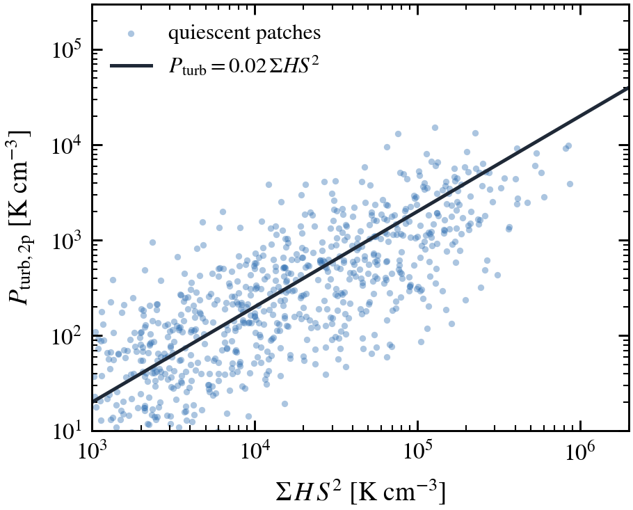

## Largest cluster and weight
25 Myr intervals. x: the 90th percentile of $\{\mathcal W_c : M_{{\rm young},c} > 500\ {\rm M_\odot}\}$ over the columns and snapshots of
the interval, $\mathcal W_c$ the layer weight. y: the largest bound-cluster mass in the interval. Labels: interval start
in Myr. Line: $0.5\,\Sigma_{\rm SFR}(\mathcal W)\,A\,\tau$ with the OK22 relation, $A = 0.25$ kpc$^2$, $\tau = 10^7$ yr,
nothing fitted. Open circle: the interval in which fewer
than 5 % of the clean columns have M_young > 500. Result: seven active intervals follow the line, slope 0.94 against the
median weight with 0.09 dex scatter; the quiescent interval lies 100 times below.

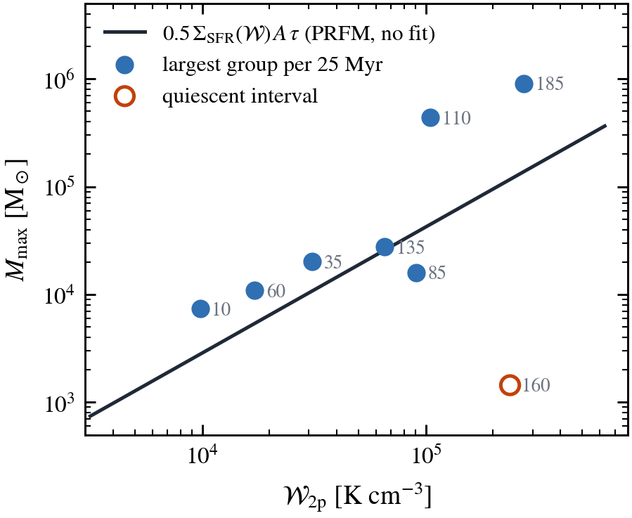

## Duty cycle
x: layer $\mathcal W_c$ of a clean column. y: points, per 0.5 dex bin: the fraction of columns in the bin with
$M_{{\rm young},c} > 500$ M$_\odot$; lines:

$$P(\mathcal W) = \left[1 + \exp\!\big(-k\,(\log_{10}\mathcal W - \log_{10}\mathcal W_{50})\big)\right]^{-1}$$

with $k$ and $\mathcal W_{50}$ by maximum likelihood over the columns of the phase.
Result: log W_50 = 3.75, 3.86, 4.73, 4.95; the same fit against rho_mid moves by less than 0.5 dex between phases.

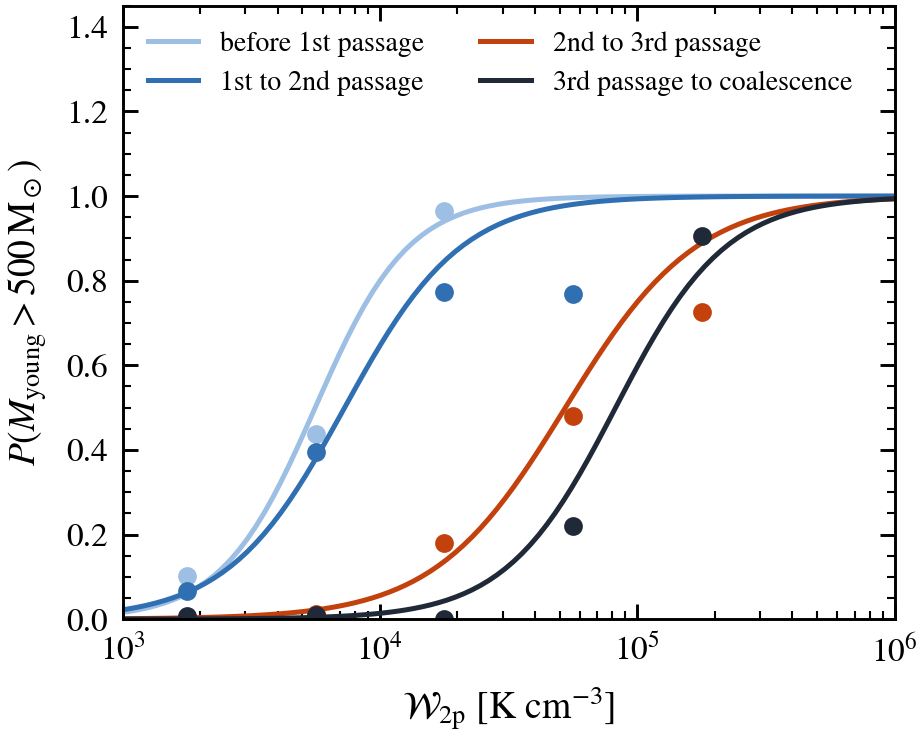

## Burst-mass distribution
Phase 40 to 110 Myr. Black: N_k / ΔM_k over the bursting columns (M_young > 500 Msun) of the phase, all snapshots,
error √N_k / ΔM_k. Blue: 25 realisations of the null model: every clean column of the phase bursts with probability $P(\mathcal W_c)$
from the logistic above; a bursting column gets $M = 10^{\,a + b\log_{10}\mathcal W_c + s\,\xi}$, $\xi\sim N(0,1)$, with
$b$ from a least-squares fit of $\log M_{\rm young}$ on $\log\mathcal W$ over the phase's bursts and $(a, s)$ from a lognormal
likelihood truncated at 500 M$_\odot$; masses below
500 are dropped and the rest binned as the data. All ingredients are fitted to the same bursts, so the comparison tests only
whether the histogram contains structure beyond them. Result: it does not.

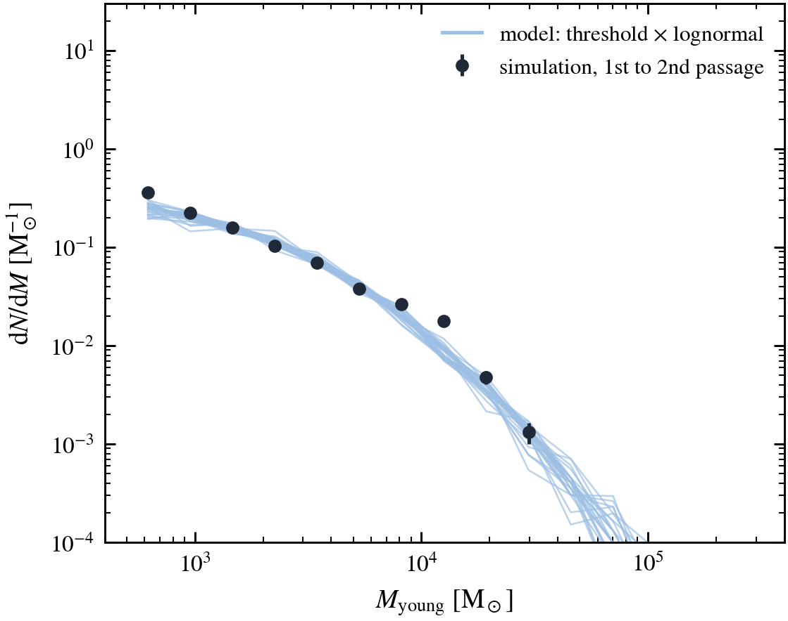

## Clump virial parameter and efficiency
Left. x: $\sigma_{\rm eff} = (P_{{\rm tot},c}/\rho_{{\rm mid},c})^{1/2}$ of the full column $c$ containing the clump at its
pre-onset snapshot, in km s$^{-1}$. y: alpha_vir of the clump at that
snapshot (definition under Clouds). Points: the lineages of the efficiency figure; lines: medians per sigma_eff bin per
phase; dashed: alpha ∝ sigma_eff². Result: one relation for all phases with 0.2 dex offsets.

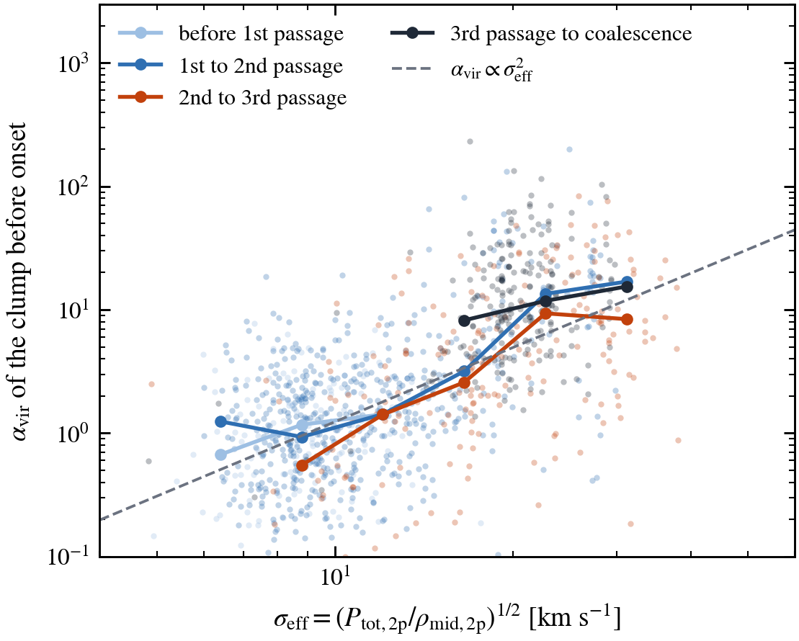

Right. x: $\alpha_{\rm vir,tot} = \alpha_{\rm vir}\,(1 + v_A^2/\sigma_{\rm 3d}^2)$ of the clump at its pre-onset snapshot.
y: $\epsilon_{\rm int}$. Black: median over all phases per bin. Dashed:

$$\epsilon(\alpha) = \epsilon_u + \frac{\epsilon_b - \epsilon_u}{1 + (\alpha/\alpha_c)^m},$$

fitted by least absolute deviation in $\log\epsilon$: $\epsilon_b = 0.050$, $\epsilon_u = 0.0012$, $\alpha_c = 4.0$,
$m = 4.7$; residual scatter 0.69 dex.

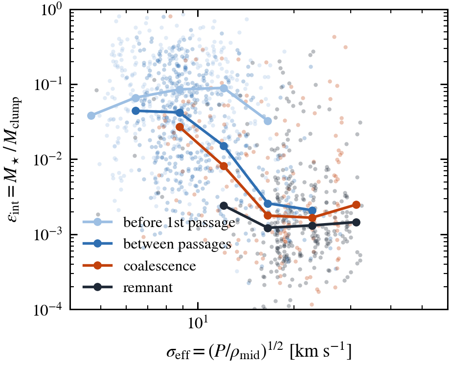

## What the model gets and does not get
- Vertical balance, the pressure per unit star formation before the second passage, the shear term for the quiet patches: yes.
- Which patches form stars: to a factor of 2 from the density threshold.
- The amount of star formation per interval from the bound fraction: to a factor of 2 before the second passage and exactly in the
  quiescent interval; wrong by 3 and 70 in the two pericentre bursts, which are compression events the model does not
  contain.
- The cluster mass function: the flattening (0.40 predicted, 0.40 measured) and the rise of the top (45 vs 15); the
  absolute slope is 0.15 to 0.2 too steep in every phase.
- The largest cluster per interval: linear in the weight of the active patches over seven intervals, 0.09 dex; the
  quiescent interval 100 times below.
- Not reproduced or not modelled: the timing of the bursts, the two efficiency levels, the 0.7 dex clump-to-clump scatter,
  the mass dependence of boundedness that drives the flattening (measured, used as input).

Part C is reserved for a calculation that takes as input only the state of the layer, its weight and what drives its
turbulence, and returns the cluster mass function, with the simulation used solely to test the result. Nothing in Part B
qualifies: every chain there reads the clump population, the efficiency levels, their scatter and the capture fraction from
the run. For C to exist it has to contain, with no quantity taken from the simulation:

1. the effective dispersion of the layer from the energy budget of the driving, feedback yield or shear injection, without
   a coefficient fitted here;
2. the population of dense clumps, mass function and mass-size relation, from fragmentation of the turbulent layer at that
   dispersion; this is also what decides whether massive clumps stay bound when the dispersion rises;
3. the fraction of each clump that turns into stars from a collapse calculation, including why bound clumps convert a few
   percent and unbound ones a tenth of that;
4. how the stars of a collapsing complex divide into clusters, in place of the measured capture fraction.

The measurements of Part A and the chain of Part B say what such a calculation must reproduce: an invariant clump mass
function of slope 1.6, a clump velocity dispersion inherited from the layer as a square-root cascade, a boundedness
threshold at the virial criterion, a bound efficiency near 5 %, a hundredfold suppression of star formation when the layer
dispersion doubles at fixed weight, and a cluster mass function that flattens from 1.92 to 1.52 with its top rising
fifteenfold.

---
---
# Part C. The closed calculation (not done)

Part C is reserved for a calculation that takes as input only the state of the layer, its weight and what drives its
turbulence, and returns the cluster mass function, with the simulation used solely to test the result. Nothing in Part B
qualifies: every chain there reads the clump population, the efficiency levels, their scatter and the capture fraction from
the run. For C to exist it has to contain, with no quantity taken from the simulation:

1. the effective dispersion of the layer from the energy budget of the driving, feedback yield or shear injection, without
   a coefficient fitted here;
2. the population of dense clumps, mass function and mass-size relation, from fragmentation of the turbulent layer at that
   dispersion; this is also what decides whether massive clumps stay bound when the dispersion rises;
3. the fraction of each clump that turns into stars from a collapse calculation, including why bound clumps convert a few
   percent and unbound ones a tenth of that;
4. how the stars of a collapsing complex divide into clusters, in place of the measured capture fraction.

The measurements of Part A and the chain of Part B say what such a calculation must reproduce: an invariant clump mass
function of slope 1.6, a clump velocity dispersion inherited from the layer as a square-root cascade, a boundedness
threshold at the virial criterion, a bound efficiency near 5 %, a hundredfold suppression of star formation when the layer
dispersion doubles at fixed weight, and a cluster mass function that flattens from 1.92 to 1.52 with its top rising
fifteenfold.
