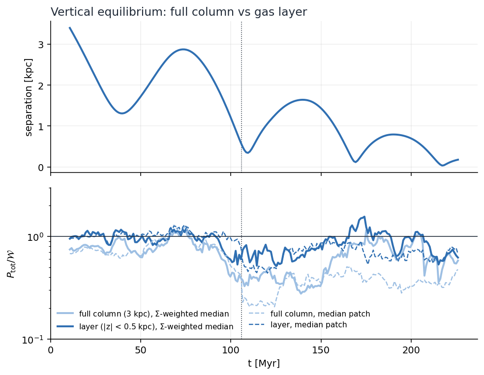
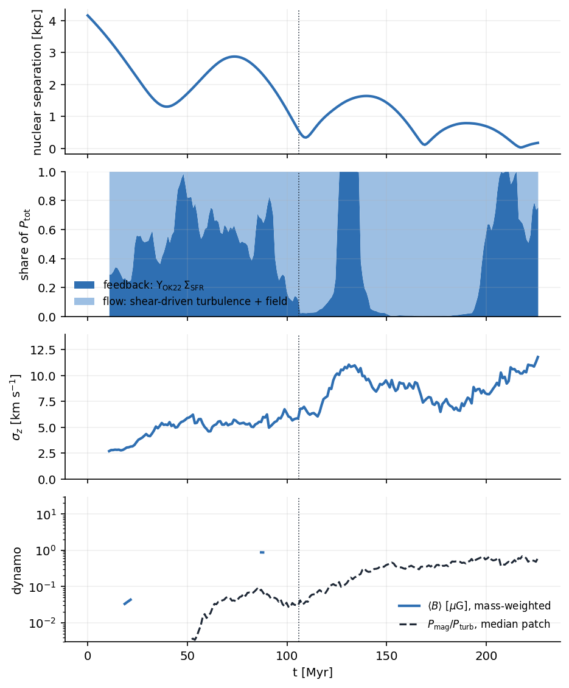
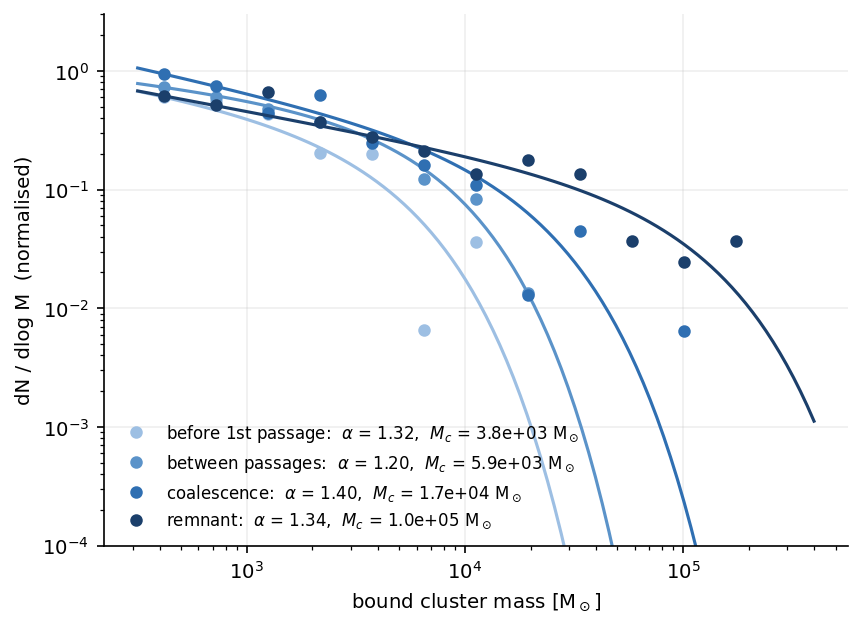
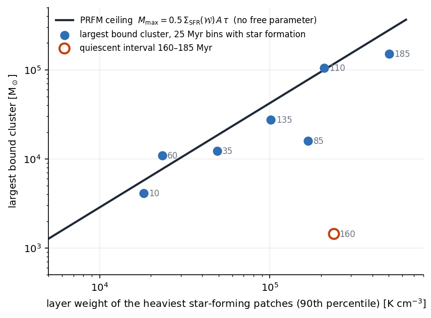
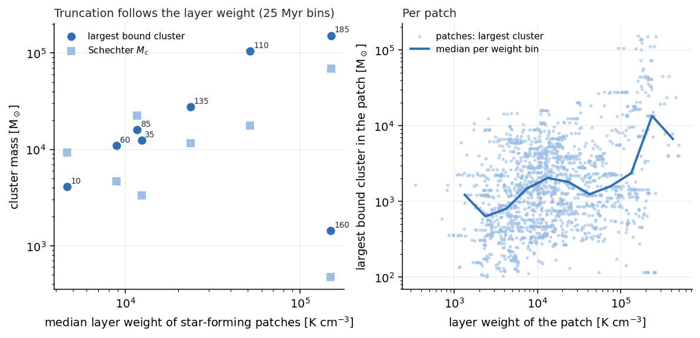

# merger_prfm

Key figures from the PRFM (pressure-regulated, feedback-modulated; Ostriker & Kim 2022) test of the dwarf-galaxy merger
simulation and its link to the star cluster mass function. Analysis code lives in `/raven/u/uli/dwarf_merger` (prfm/, clusters/),
data products in `/ptmp/uli/dwarf_merger`. Figures are being converted to paper style one by one (`prfm/paper_figs.py`).

## 1. Merger phases
Nuclear separation vs time; the four phases used throughout.

## 2. Vertical equilibrium
P_tot / W vs time for the full 3 kpc column and for the 0.5 kpc gas layer. With the layer weight, equilibrium holds to 5 % in the
disc phase and the remnant and falls 20-35 % short during coalescence.

Line of sight: the disc is an equilibrium layer only along the angular-momentum normal; after coalescence no orientation makes the
debris a layer.

## 3. Where the pressure comes from
Fraction of the midplane pressure supplied by feedback (OK22 yields) vs by the flow; the patch-scale shear closure with
epsilon_S = 0.02; magnetic-field growth and the magnetic-to-kinetic pressure ratio.

## 4. Cluster mass function
Per merger phase; the slope above 300 Msun is robust to N_min, linking length, the intruder cut and the bound flag.

## 5. The link: weight sets the ceiling
Largest bound cluster vs young stellar mass of the patch (M_max ~ 0.5 M_young), and the largest cluster per 25 Myr vs the layer
weight of the star-forming patches (M_max ~ W_L^1.07, 0.1 dex scatter; the quiescent bin sits 100x below).

## 6. Burst-mass distribution at fixed weight
At fixed layer weight the 10 Myr burst mass of a 0.5 kpc patch is lognormal (0.4 dex wide in the disc phases); the duty cycle is
a midplane-density threshold. A mock built from the real weights, the density-threshold duty cycle and the lognormal kernel
reproduces the slope of the burst-mass distribution in every phase, but not its top.

