# merger_prfm

Does pressure-regulated, feedback-modulated star formation (PRFM; Ostriker & Kim 2022) survive a galaxy merger, and
how does the state of the gas layer set the state of the clumps that form stars in it? One simulation of two gas-rich
dwarf galaxies merging (4 Msun gas and star particles, 0.4 pc softening, magnetic fields, resolved supernovae), 226 Myr
through three pericentre passages to the final coalescence. This is a gas paper: the chain from the weight of the layer
to its pressure, its turbulence, the state of its cold clumps and the stellar mass each clump produces is measured link
by link. The young stellar groups are read as the record of that chain. Whether they are bound clusters, how compact
they are and whether they survive is set by the star formation criterion of the code at the resolution limit (see the
cluster section) and is not a result of this or any galaxy-scale simulation of this type.

Three parts, kept apart. **A**: what the simulation shows, figures with what is plotted and the numbers. **B**: the
story from star formation to star-cluster formation as the run tells it, written as relations with constants fitted
to the run. It is not a model: nothing in it predicts a cluster mass from the layer state without reading the answer
from the simulation somewhere along the chain. What it offers is mathematical insight into which steps are simple and
which are not. **C**: the theory one would want, a closed calculation from the layer state to the cluster mass function.
It does not exist; Part C states what it would have to contain.

## Status of the PRFM comparison

Reference: the Ostriker & Kim (2022) calibration. The run's own undisturbed disc lasts only from 25 to 40 Myr, since the
first 25 Myr are the isothermal initial state relaxing and the discs are tidally disturbed from the first passage on.

| | before 1st passage | 1st to 2nd | 2nd to 3rd | 3rd to coalescence |
|---|---|---|---|---|
| P over W, layer 1 kpc deep | 1.03 | 0.94 | 0.71 | 0.85 |
| pressure per unit SFR over the yield, 10 Myr SFR | 1.9 | 1.7 | 43 | 2.8 |
| same, 40 Myr SFR as in OK22 | 0.6 | 1.6 | 2.6 | 10.5 |
| SFR at fixed weight vs OK22, 0.5 kpc columns (dex) | -0.5 | -0.6 | -1.8 | -2.2 |
| same, 0.25 kpc columns (dex) | -0.2 | -0.5 | -1.6 | -2.1 |

Durations. Pressure over weight leaves 0.7 to 1.4 for 24 % of the run (97 to 141 Myr and short episodes at the later
pericentres) and never leaves 0.5 to 2. The pressure per unit star formation exceeds 3 times the yield for 36 % of the run
with the 40 Myr rate (107 to 125 and 157 to 207 Myr) and 10 times for 23 % (108 to 120 and 166 to 198 Myr); its
time-median over the whole run is 2.1.

Reading. Vertical balance survives the merger, with one interval of moderate shortfall around the second passage during
which the gas is not a layer in any orientation. The supply of that pressure by star formation does not survive, and the
averaging window decides how much of the discrepancy is a delay and how much is a failure. Counting the time after
40 Myr for which the ratio to the yield exceeds a factor:

| ratio above | with the 10 Myr rate | with the 40 Myr rate |
|---|---|---|
| 3 | 48 % of the run (95 to 124, 138 to 197 Myr) | 39 % (107 to 125, 157 to 204 Myr) |
| 10 | 37 % (107 to 120, 142 to 195 Myr) | 25 % (108 to 120, 166 to 198 Myr) |
| 30 | | 15 % (167 to 195 Myr) |

The 40 Myr rate that OK22 use removes most of the excess between the second and third passage (phase median 43 with the
10 Myr rate, 2.6 with the 40 Myr rate): those stars formed at the 125 to 135 Myr burst and their supernovae kept the
layer pressurised for 40 Myr afterwards, which is what the longer window is for. It does not remove the excess after the
third passage (phase median 2.8 with the 10 Myr rate, 10.5 with the 40 Myr rate). The hard core of the failure is
167 to 195 Myr, 28 Myr in which the ratio is above 30 with either rate and the supernova rate of the columns is at its
disc value: the weight jumped by 3 at the third passage, the pressure followed at once, turbulent and magnetic, and no
star formation is behind it. A still longer window would only average in the earlier burst, whose supernovae had ended
by 165 Myr, and would hide that interval rather than explain it.

What happens in that interval, with every step measured (figures under "Delay between pressure and star formation"):
the third passage raises the weight by 3 and the layer follows it within a few Myr, so vertical balance holds and the
pressure is turbulent and magnetic; the supernova rate per unit 40 Myr star formation is normal, so feedback did not
supply that pressure; the same compression raises the effective dispersion of the layer from 9.9 to 17.9
$\rm km\ s^{-1}$, and the cascade hands it to the clumps, whose median $\alpha_{\rm tot}$ rises from 6 to 49, three
quarters of that from their own dispersion doubling; the dense gas is not removed but unbound, with 2.6 times more mass
above 100 $\rm cm^{-3}$ than in the discs and 21 times less of it below the virial threshold; and the star formation
rate falls by the same factor as the bound mass. Pressure up 3, star formation down 15, and both from the same event.
PRFM's vertical balance survives all of it; what breaks is the assumption that feedback supplies the pressure, and it
breaks in the trough between bursts, not in the bursts themselves. The excess is not a
pressure problem: the pressure stays within a factor of 2 of the weight while the star formation rate collapses by 2.5 dex
between bursts, so the ratio runs away on its denominator. At the peak of the 125 to 135 Myr burst the layer holds only 0.2 to 0.5 of the yield,
i.e. less pressure per unit star formation than the TIGRESS calibration. Star formation lags the pressure by 8 to 12
Myr at the passages, which times the bursts but does not account for the excess: shifting the star formation rate by
the lag leaves the phase median at 30 to 60, since the pressure stays at the weight for 50 Myr while the cold gas,
present at a depletion time of 48 Gyr, does not form stars. The star formation rate
at fixed weight falls below the OK22 relation by 0.5 dex in the discs and 2 dex after the second passage, at every column
size. The balance test itself is meaningful only for columns at least 1 kpc deep and within about 30 degrees of the disc
normal; the yield and rate comparisons depend on neither.

---
---
# Part A. What the simulation shows

## Definitions used by every figure

**Columns.** For each galaxy a $12\times12$ grid of columns of side $L = 0.5$ kpc is laid in the plane perpendicular to the
gas angular-momentum vector measured within 2 kpc of the galaxy centre; the centre is the median position of that galaxy's
initial stellar disc particles (membership by particle ID). From the second passage on (106 Myr, when the centres first
come within 0.5 kpc and the gas of the two galaxies mixes) the two grids are replaced by one grid centred midway between
the two stellar centres, with the normal from the gas angular momentum within 3 kpc of that point and the rest frame from
the mean velocity of all stars within 3 kpc; nothing is labelled by galaxy after that time. (Before this change two
overlapping grids were kept until the centres were within 0.5 kpc, which counted the same gas twice after the second
passage; the vertical-equilibrium and yield figures show that earlier result as a dotted line for comparison.) A *full column* spans
$|z| < 1.5$ kpc about the grid plane; a *layer column* spans $|z - z_{\rm mid}| < 0.5$ kpc about the midplane of that
column measured in the full-column run. Only columns with $\Sigma_{\rm gas} > 1\ {\rm M_\odot\ pc^{-2}}$ are used, and
before the second passage only columns in which less than 10 % of the gas belongs to the other galaxy by particle ID.

**Gas quantities per column.** Sums run over the gas particles $i$ inside the column (footprint $A = L^2$), with mass
$m_i$, height $z_i$ along the column normal $\hat n$, velocity $\mathbf v_i$, density $\rho_i$, specific internal energy
$u_i$, temperature $T_i$ and magnetic field $\mathbf B_i$. "2p" denotes particles with $T_i < 2\times10^4$ K.

$$\Sigma_{\rm gas} = \frac{1}{A}\sum_i m_i, \qquad
z_{\rm mid} = \frac{\sum_i m_i z_i}{\sum_i m_i}, \qquad
H = \left[\frac{\sum_i m_i (z_i - z_{\rm mid})^2}{\sum_i m_i}\right]^{1/2}$$

The *slab* is $|z_i - z_{\rm mid}| < h_s$ with $h_s = \max(25\ {\rm pc},\ 0.25\ H)$ and volume $V_s = 2 h_s A$.
With $v_{n,i} = (\mathbf v_i - \mathbf v_{\rm gal})\cdot\hat n$, $\mathbf v_{\rm gal}$ the mean velocity of the galaxy's
stellar particles within 1.5 kpc of its centre, and $\bar v_n$ the mass-weighted mean of $v_{n,i}$ over the 2p slab
particles:

$$P_{\rm th} = \frac{1}{V_s}\sum_{i\in{\rm slab,2p}} m_i(\gamma-1)u_i,\qquad \gamma = 5/3$$

$$P_{\rm turb} = \frac{1}{V_s}\sum_{i\in{\rm slab,2p}} m_i\ (v_{n,i}-\bar v_n)^2$$

$$\Pi_{\rm mag} = \frac{1}{V_s}\sum_{i\in{\rm slab,2p}} \frac{m_i}{\rho_i}\ \frac{B_i^2 - 2B_{n,i}^2}{8\pi},
\qquad B_{n,i} = \mathbf B_i\cdot\hat n$$

$$P_{\rm mag} = \frac{1}{V_s}\sum_{i\in{\rm slab}} \frac{m_i}{\rho_i}\ \frac{B_i^2}{8\pi}$$

$$P_{\rm tot} = P_{\rm th} + P_{\rm turb} + \Pi_{\rm mag}, \qquad
\rho_{\rm mid} = \frac{1}{V_s}\sum_{i\in{\rm slab,2p}} m_i$$

**All of $P_{\rm th}$, $P_{\rm turb}$, $\Pi_{\rm mag}$, $P_{\rm tot}$, $\rho_{\rm mid}$ and $\mathcal W$ are computed
from the two-phase gas only ($T < 2\times10^4$ K); hot gas is excluded.** This is the quantity Ostriker & Kim (2022) write
as $P_{\rm tot,2p}$ and calibrate their yields and star-formation relations against. The figure axes carry the subscript
2p on every pressure, weight and density; the text drops it. Every figure
that shows a pressure, a weight or a midplane density uses these two-phase quantities, including the pressure per unit
star formation rate, the vertical-equilibrium ratio, the pressure shares and the time evolution. The only quantity that
includes the hot gas is $P_{\rm mag}$, summed over all slab particles.
$\Pi_{\rm mag}$ is the vertical Maxwell stress, the magnetic term that supports the layer against its weight (it can be
negative); $P_{\rm mag}$ is the magnetic pressure and is used only for the field strength and the equipartition
comparison. All pressures are quoted as $P/k_{\rm B}$ in $\rm K\ cm^{-3}$; code units ${\rm M_\odot\ (km/s)^2\ kpc^{-3}}$
convert with the factor $4.90\times10^{-6}$, and the magnetic terms are computed in $\rm erg\ cm^{-3}$ and divided by
$k_{\rm B}$.

**Weight.** With $g_{n,i} = \mathbf g_i\cdot\hat n$ the gravitational acceleration along the normal at particle $i$,

$$\mathcal W = \frac{1}{2A}\left[\sum_{z_i > z_{\rm mid},\ 2p} m_i\ (-g_{n,i}) \ +\  \sum_{z_i < z_{\rm mid},\ 2p} m_i\ g_{n,i}\right],$$

the mean of the weight of the gas above the midplane and of that below, each the integral of $\rho\ g_n$ through its half
of the column.

**Gravitational acceleration.** $\mathbf g_i$ is the acceleration from all gas, star and dark-matter particles of the
snapshot, evaluated at the position of every gas particle with a two-level particle-mesh solve:

1. Mass deposition: cloud-in-cell onto a coarse grid of $512^3$ cells over $\pm32$ kpc about the box centre (cell
   125 pc) and a fine grid of $512^3$ cells over $\pm4$ kpc (cell 15.6 pc). Gas and stars are deposited on both grids;
   dark matter on the coarse grid only.
2. Potential: on each grid the Poisson equation is solved with isolated boundary conditions by zero-padding the mass grid
   to $1024^3$ and convolving with the Green's function $-G/\sqrt{r^2+\epsilon^2}$ by FFT, with the Plummer softening
   $\epsilon = 1.5$ cells (188 pc coarse, 23 pc fine).
3. Acceleration: $\mathbf g = -\nabla\Phi$ by centred finite differences on each grid, interpolated trilinearly to the
   particle position.
4. Combination: the coarse field of everything, corrected inside the fine box by the difference between the fine-grid
   field and the coarse-grid field of the same particles (gas and stars inside the fine box):

$$\mathbf g_i = \mathbf g^{\rm c}_{\rm all} + \big(\mathbf g^{\rm f}_{\rm gas+stars} - \mathbf g^{\rm c}_{\rm gas+stars,\ inner}\big).$$

Every column lies inside the fine box, so the gas and stellar field entering $\mathcal W$ is resolved at 15.6 pc; the
dark-matter field is resolved at 125 pc.

Check: on every snapshot the acceleration of 64 random gas particles inside $\pm2.5$ kpc is compared with a direct sum
over all particles of the snapshot with 20 pc Plummer softening. The median relative error $|\mathbf g_{\rm PM} - \mathbf g_{\rm direct}|/|\mathbf g_{\rm direct}|$
is 0.09 over the run (0.06 to 0.14 between the 10th and 90th percentile of snapshots, maximum 0.20).

$g_{n,i} = \mathbf g_i\cdot\hat n$ is then the component along the column normal. In the weight sum above the gas
particles are those of the full column with $T < 2\times10^4$ K; the acceleration they feel is from all matter. The
same sum with the acceleration from gas, stars or dark matter alone gives the split of the weight by source.

**Star formation rate.** Over the stars in the column that formed during the run (the initial stellar particles are
excluded),

$$\Sigma_{\rm SFR,10} = \frac{1}{A\ (10\ {\rm Myr})}\sum_{{\rm age}<10\ {\rm Myr}} m_\star, \qquad
\Sigma_{\rm SFR,40} = \frac{1}{A\ (40\ {\rm Myr})}\sum_{{\rm age}<40\ {\rm Myr}} m_\star,$$

in ${\rm M_\odot\ yr^{-1}\ kpc^{-2}}$; $M_{\rm young} = \sum_{{\rm age}<10\ {\rm Myr}} m_\star$ is the same sum without
the division.

**Ostriker & Kim (2022) relations used.**

$$\Upsilon_{\rm tot}(P) = 10^{-0.212\log_{10}P + 3.86}\ {\rm km\ s^{-1}}\ \ ({\rm eq.\ 26c}),\qquad
\Sigma_{\rm SFR}(\mathcal W) = 10^{1.17\log_{10}\mathcal W - 7.32}\ \ ({\rm eq.\ 28b}),\qquad
\Sigma_{\rm SFR}(P) = 10^{1.18\log_{10}P - 7.43}\ \ ({\rm eq.\ 28a}),$$

with $P$, $\mathcal W$ in $\rm K\ cm^{-3}$ and $\Sigma_{\rm SFR}$ in ${\rm M_\odot\ yr^{-1}\ kpc^{-2}}$. A pressure per unit
star formation rate in $\rm K\ cm^{-3}$ per ${\rm M_\odot\ yr^{-1}\ kpc^{-2}}$ is converted to $\rm km\ s^{-1}$ by dividing by
$4.81\times10^3$.

**Group finding.** Friends-of-friends: two particles are linked if their separation is below the linking length $l$; a
group is a connected component of the link graph; groups with fewer than $N_{\min} = 25$ particles are discarded (every
gas and star particle has 4 $\rm M_\odot$, so $N_{\min}$ = 100 $\rm M_\odot$). Clusters: stars younger than 10 Myr, $l = 5$ pc.
Clouds: gas with $T < 1000$ K and $n_{\rm H} > 10$ $\rm cm^{-3}$, $l = 3$ pc. Clumps: gas with $n_{\rm H} > 100$ $\rm cm^{-3}$,
$l = 1.5$ pc. Group finding is repeated independently on each snapshot used; nothing is tracked between snapshots except
the clump lineages described under Clouds. Per group, with sums over members,

$$M = \sum_i m_i,\qquad \mathbf x_{\rm com} = \frac{\sum_i m_i \mathbf x_i}{M},\qquad
\mathbf v_{\rm com} = \frac{\sum_i m_i \mathbf v_i}{M},\qquad r_h:\ \ M(< r_h) = M/2 \text{ about } \mathbf x_{\rm com}.$$

**Boundedness of clusters.**

$$E_{\rm kin} = \tfrac12\sum_i m_i\ |\mathbf v_i - \mathbf v_{\rm com}|^2,\qquad
E_{\rm pot} = -G\sum_{i < j}\frac{m_i m_j}{\sqrt{r_{ij}^2+\epsilon^2}},\qquad \epsilon = 1\ {\rm pc},$$

summed over the group's own members only (no external potential, no tidal term); a cluster is *bound* if
$E_{\rm kin} + E_{\rm pot} < 0$. For groups of more than 40 000 members the pair sum is replaced by
$E_{\rm pot} = \tfrac12 M \langle\phi\rangle$ with $\langle\phi\rangle$ the mean of the softened potential from all members at
4000 randomly chosen members. Every group is tested and kept; nothing is excluded as a nucleus. (An earlier version of
this catalogue excluded groups above 40 000 members or $r_h > 20$ pc untested; those hold two thirds of the stars formed
after the second passage and are bound, see the cluster formation efficiency below.) Clouds and clumps are not
energy-tested; their boundedness enters only through $\alpha_{\rm vir}$ as defined under Clouds.

**Robustness of the group catalogue.** The mass function of the young stellar groups was recomputed with linking
lengths of 3, 5 and 8 pc, with minimum group sizes of 10, 25 and 50 particles, and for all groups against bound groups
only (every tenth snapshot, whole box). The maximum-likelihood index above 300 $\rm M_\odot$ changes by at most 0.05 with
the linking length (per phase 1.99/1.99/1.97, 1.83/1.82/1.80, 1.72/1.70/1.67, 1.54/1.56/1.54 for 3/5/8 pc) and by at most
0.09 between all and bound groups (bound only: 1.95, 1.78, 1.68, 1.47). The minimum group size sets only the completeness
limit: the 10- and 25-particle catalogues contain the same groups above 100 $\rm M_\odot$, and the 50-particle catalogue
is incomplete below 200 $\rm M_\odot$. The bound fraction of groups between 100 and 300 $\rm M_\odot$ falls from 0.75 before
the first passage to 0.30 after the third, which is why the mass function is quoted from 300 $\rm M_\odot$ up; above
1000 $\rm M_\odot$ at least 75 % of the groups are bound in every phase. The Subfind-style unbinding leaves 95 %, 95 %,
91 % and 66 % of the group mass self-bound in the four phases (the last value is the 20 pc structure at the merged
nucleus after 205 Myr, which its own stars do not bind); the bound groups above 300 $\rm M_\odot$ have median half-mass
radii of 0.23 to 0.33 pc in every phase, at the 0.4 pc softening of the run.

**Time-series statistic.** Where a figure shows one value per snapshot from many columns, it is the
$\Sigma_{\rm gas}$-weighted median over the columns: the value $r$ for which
$\sum_{c:\ r_c\le r}\Sigma_{{\rm gas},c} = \tfrac12\sum_c \Sigma_{{\rm gas},c}$.

**Phases.** 25 to 40 Myr (before the first passage), 40 to 110, 110 to 169, 169 to 226 Myr, split at the pericentres 40,
110, 169 Myr; the final coalescence is at 217 Myr. The first 25 Myr are excluded (isothermal initial state relaxing).

## Merger phases
x: time since the start of the run. y: $d(t) = |\mathbf c_A - \mathbf c_B|$, with $\mathbf c_X$ the median position of the initial
stellar disc particles of galaxy X (galaxy A: particle IDs $\le 26\ 000\ 000$). Dotted lines: pericentres at 40, 110, 169 Myr; solid: final
coalescence at 217 Myr.

## Time evolution of the layer
In the next three figures each galaxy is shown separately before the second passage (its own grid, intruder cut
applied) and the single merged grid from 106 Myr on.

**Midplane pressure.** x: time. y, per snapshot and grid: the $\Sigma_{\rm gas}$-weighted median over the clean layer
columns of $P_{\rm tot} = P_{\rm th} + P_{\rm turb} + \Pi_{\rm mag}$ as defined above.

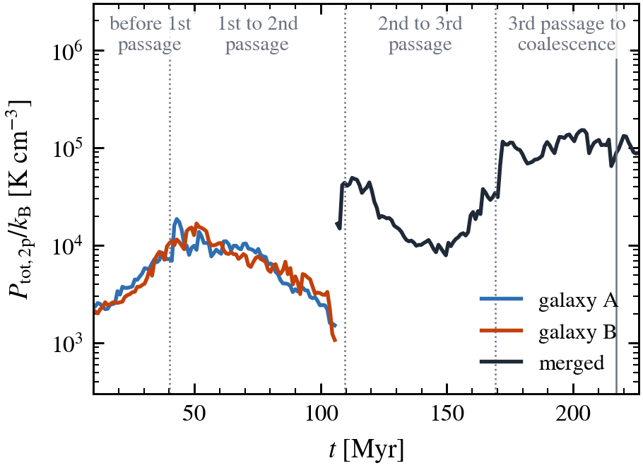

**Midplane density.** x: time. y, per snapshot and grid: the $\Sigma_{\rm gas}$-weighted median over the clean layer
columns of $n_{\rm H,mid} = X_{\rm H}\ \rho_{\rm mid}/m_{\rm p}$ with $\rho_{\rm mid}$ the slab density of the 2p gas
defined above and $X_{\rm H} = 0.76$.

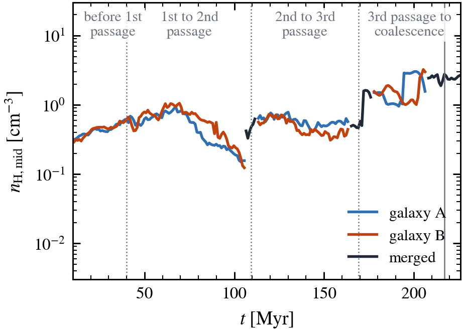

**Star formation rate surface density.** x: time. y, per snapshot and grid: the mean of $\Sigma_{\rm SFR,10}$ over the
clean full columns, i.e. the mass of stars younger than 10 Myr in those columns divided by 10 Myr and by their total area.

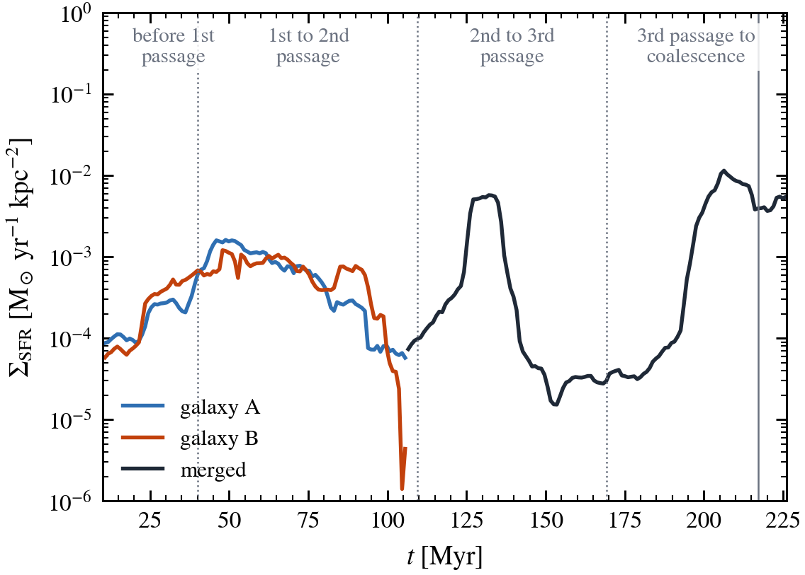

**Star formation rate of the whole run.** x: time. y: ${\rm SFR}(t;\Delta t) = \frac{1}{\Delta t}\sum m_\star$ over all
stars in the last snapshot with formation time in $(t-\Delta t,\ t]$, for $\Delta t$ = 10, 20, 30, 40 Myr (present
particle masses, 3.98 $\rm M_\odot$; each curve starts at $t = \Delta t$).

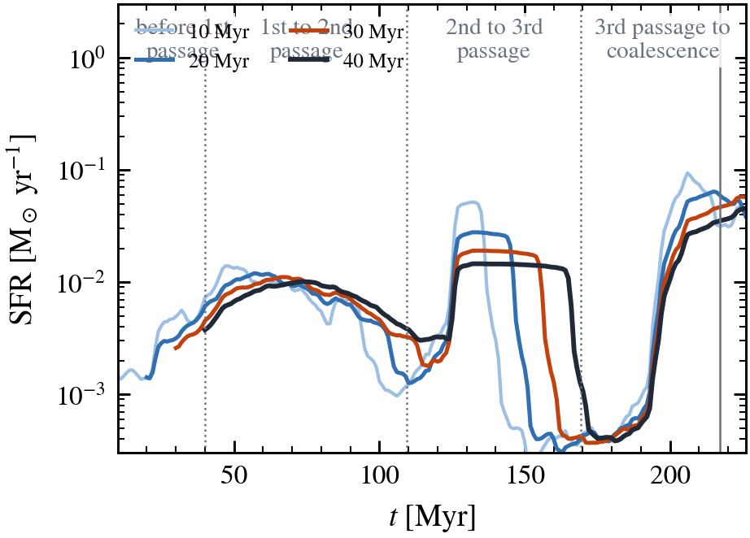

## Vertical equilibrium
x: time. y, per snapshot: the $\Sigma_{\rm gas}$-weighted median over the clean columns $c$ of $r_c = P_{{\rm tot},c}/\mathcal W_c$. Light: full columns (|z| < 1.5 kpc about the grid plane); dark:
layer columns (|z − z_mid| < 0.5 kpc), with P_tot and W as defined above in both cases. Result: layer 1.05, 0.94, 0.73, 0.96
in the four phases, never outside 0.5 to 2; the full column drops to 0.4 between the second and third passage because it
then includes the dark-matter weight of gas streaming outside the layer.

## Pressure per unit star formation
x: time. y, per snapshot, with $c$ running over the clean layer columns of that snapshot:

$$y = \frac{\sum_c P_{{\rm tot},c}}{\sum_c \Sigma_{{\rm SFR,10},c}}\ \Big/\ 4.81\times10^{3}\quad[{\rm km\ s^{-1}}],$$

the pressure the layer holds per unit star formation rate, the quantity Ostriker & Kim call the yield; $P_{\rm tot}$ is the
two-phase ($T < 2\times10^4$ K) pressure defined above, hot gas excluded. Dashed:
$\Upsilon_{\rm tot}(\bar P)$ at $\bar P = \sum_c \Sigma_{{\rm gas,2p},c}P_{{\rm tot},c}/\sum_c \Sigma_{{\rm gas,2p},c}$. Result: within a factor of 2 of the yield before the second passage, 10 to 100 times above it
in the quiet intervals after, back to the yield during the two nuclear bursts.

## Delay between pressure and star formation
Test of whether the yield excess is a causal delay: the pressure responds to the weight at once, star formation only
after the gas has collapsed. Series per snapshot: $\log P_{\rm tot}$ and $\log\mathcal W$, the $\Sigma_{\rm gas}$-weighted
medians over the clean layer columns; $\log{\rm SFR}$, the star formation rate of the whole run in 2 Myr bins from the
formation times of all stars (frame-free). x: lag $\ell$. y: the correlation coefficient of $\log P_{\rm tot}(t)$ with
$\log{\rm SFR}(t+\ell)$ over the snapshots with $t > 25$ Myr, and the same per phase and for $\mathcal W$; positive lag
means star formation later than the pressure. Result: star formation lags the pressure by 8 Myr between the first and
second passage, 12 Myr between the second and third (correlation 0.89 at the lag against 0.39 at zero lag), and 2 Myr
after the third; 12 Myr over the whole run. The delay is real and sets the timing of the bursts, but it does not remove
the yield excess: with the star formation rate shifted by 10 to 20 Myr the phase-median pressure per unit star
formation between the second and third passage stays at 30 to 60 times the yield, because the pressure remains at the
weight for 50 Myr after the burst while the cold gas is present and not forming stars. The gas is not depleted: the
depletion time of the two-phase gas, $\Sigma_{\rm gas,2p}/\Sigma_{\rm SFR,10}$ over the clean columns, is 6 to 10 Gyr in
the discs, 48 Gyr between the second and third passage, and 2.3 Gyr after the third. The excess is gas held at the
weight with the clumps above the efficiency step, not a lag: the star formation rate predicted from the clump
population through the efficiency step follows the measured one through the burst and its collapse (Part B, "The chain
against the star formation rate").

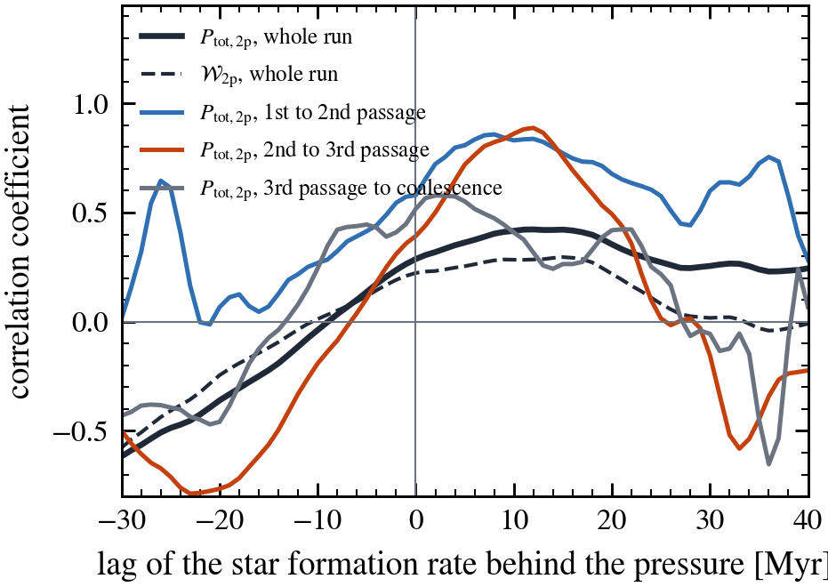

The same yield figure with the lag applied: x: time. y: $\sum_c P_{{\rm tot},c}(t) / \sum_c \Sigma_{{\rm SFR,10},c}(t+\ell)$
over the clean layer columns, in $\rm km\ s^{-1}$, for $\ell = 0$ (light) and $\ell = 12$ Myr (dark), against the OK22 yield at
$\bar P(t)$. Result: the lag moves the edges of the excursions earlier by 12 Myr and removes the spike at the second
passage (phase medians of the ratio to the yield 1.0, 2.3, 65, 2.0 against 1.9, 1.7, 43, 2.8 without lag), and leaves
the 50 Myr plateau between 140 and 195 Myr untouched.

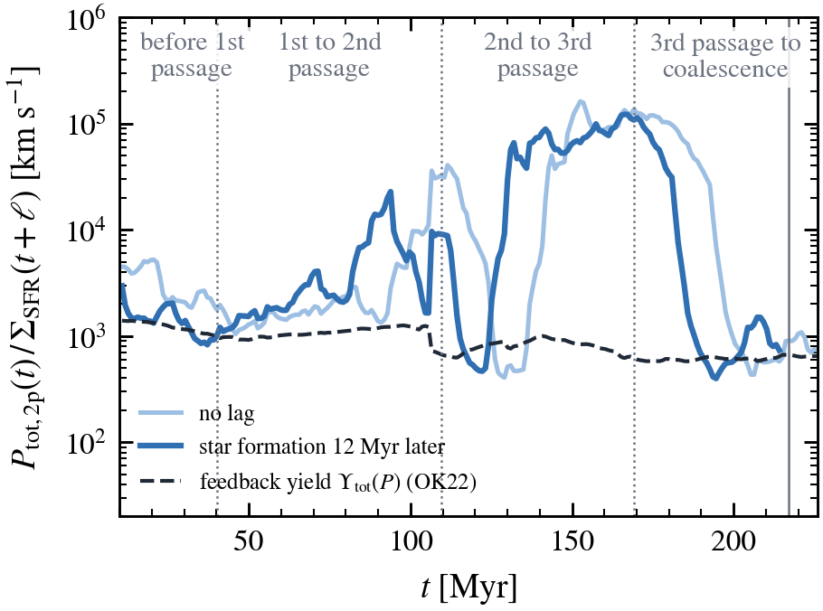

**Where the excess comes from, in 10 Myr bins.** The ratio of the pressure per unit star formation to the OK22 yield
with the 10 Myr and the 40 Myr rate, the supernova rate of the clean columns per unit 10 Myr star formation rate
(normalised to its median between 40 and 100 Myr), and the turbulent and Maxwell shares of $P_{\rm tot}$:

| bin [Myr] | ratio, 10 Myr rate | ratio, 40 Myr rate | SN rate per unit SFR | turbulent share | Maxwell share |
|---|---|---|---|---|---|
| 110 to 120 | 41 | 18 | 1.3 | 0.85 | 0.07 |
| 120 to 130 | 2.7 | 6.1 | 0.2 | 0.74 | 0.14 |
| 130 to 140 | 0.7 | 1.7 | 0.5 | 0.66 | 0.18 |
| 140 to 150 | 46 | 1.5 | 35 | 0.61 | 0.23 |
| 150 to 160 | 135 | 2.6 | 53 | 0.65 | 0.22 |
| 160 to 170 | 166 | 6.6 | 11 | 0.71 | 0.19 |
| 170 to 180 | 200 | 201 | 0.9 | 0.67 | 0.23 |
| 180 to 190 | 114 | 176 | 0.5 | 0.74 | 0.17 |
| 190 to 200 | 9 | 30 | 0.1 | 0.62 | 0.29 |
| 200 to 210 | 1.0 | 3.1 | 0.2 | 0.53 | 0.37 |

Two intervals of different kind make up the excess. From 140 to 170 Myr the 10 Myr ratio is 50 to 170 but the 40 Myr
ratio is 1.5 to 7, and the supernova rate per unit current star formation is 10 to 50 times its disc value: the
pressure is supplied by the supernovae of the 125 to 135 Myr burst, which arrive up to 40 Myr after the stars formed.
This is feedback with the delay OK22 average over by using the 40 Myr rate, not a failure of the yield relation. It
shows in the two-phase gas because what the supernovae leave in the layer is momentum, not hot gas: the hot volume
fraction of the slab stays below 0.06 throughout (the hot gas leaves the thin layer), while the turbulent pressure of
the two-phase gas per unit supernova rate in 140 to 160 Myr is 0.7 to 1.5 times its disc value, i.e. the same momentum
per supernova that regulates the discs. From 170 to 195 Myr that ratio is 80 to 90: the turbulence there is not from
supernovae.

Top: x: time; y: $\sum_c P_{{\rm turb},c}/\sum_c {\rm SN_c}$ over the clean layer columns, with $\rm SN_c$ the number of
supernovae of the last 10 Myr in column $c$ from the stellar catalogue, divided by the median of the same ratio between
40 and 100 Myr. Bottom: the $\Sigma_{\rm gas}$-weighted median over the clean layer columns of the volume fraction of the
midplane slab occupied by gas above $2\times10^4$ K. Result: the two-phase turbulent pressure per supernova sits at its
disc value from 130 to 165 Myr, i.e. the pressure of that interval is the momentum of the burst's supernovae; it
rises to 100 times the disc value from 170 to 195 Myr, and at the second passage to 20. The hot volume fraction of the
slab shown here is the $\Sigma_{\rm gas}$-weighted median over the columns, i.e. the value in the columns that carry the
mass, and it stays below 6 %. Measured instead over all gas within 2 kpc of the centre, without weighting by column
mass, the fraction above $2\times10^4$ K within 50 pc of the midplane is 0.15 at 59 Myr, 0.05 at 147 Myr and 0.04 at
176 Myr, and it rises with height to 0.34 at 0.8 to 1.6 kpc and 0.81 at 1.6 to 3.2 kpc at 147 Myr (0.15 and 0.59 at
176 Myr): the hot gas is in the halo, not in the layer. At 176 Myr no gas within 2 kpc is above $10^6$ K at all, so in
the interval where the pressure exceeds the yield by 100 the layer has no hot phase to speak of and its support is
turbulent and magnetic in the warm and cold gas.

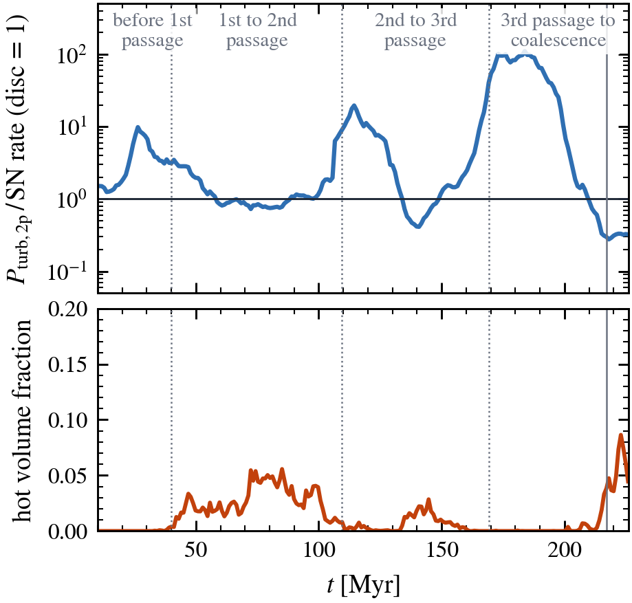
 From
170 to 195 Myr both ratios are 100 to 200 and the supernova rate is at or below its disc value: no feedback supplies the
pressure. The weight has jumped by 3 at the third passage, $P_{\rm tot}/\mathcal W$ is 0.85 to 1, and the support is
turbulent (0.7) and magnetic (0.2). This interval, 25 Myr, is the genuine departure: the layer is in vertical balance
with a pressure that no star formation produced and that the star formation does not respond to for 25 Myr, the time
the clumps need to fall below the efficiency step (fraction below $\alpha_c$: 0.06 in this phase). What drives that
turbulence is not measured here beyond the shear-term description of Part B; the attribution to the compression of the
passage is interpretation.

The same as a figure. Top: x: time; y: the ratio of $\sum_c P_{{\rm tot},c}/\sum_c\Sigma_{{\rm SFR},c}$ over the clean layer
columns to $4.81\times10^3\ \Upsilon_{\rm tot}(\bar P)$, with the 10 Myr rate (light) and the 40 Myr rate (dark). Bottom:
the supernova rate of the same columns (supernovae of the last 10 Myr from the stellar catalogue, per column) divided
by their 10 Myr rate (light) and by their 40 Myr rate (dark), each normalised to its own median between 40 and 100 Myr.
Result: the supernova rate per unit 40 Myr star formation rate is flat at 1 within a factor of 2 for the whole run, as
it must be if the supernovae come from the stars of the last 40 Myr, which is what that window is for. Per unit 10 Myr
rate it reaches 70 between 140 and 170 Myr, the interval in which the layer is pressurised by the supernovae of the
125 to 135 Myr burst after its star formation has stopped; there the 40 Myr yield ratio is 1.5 to 7, i.e. ordinary
feedback regulation seen through the right window. From 167 to 195 Myr the supernova budget is normal by both measures
and the yield ratio is 100 to 200 with either rate: the pressure of that interval is not supernova-driven at all. The
40 Myr curves before 40 Myr include the isothermal initial state and are not used.

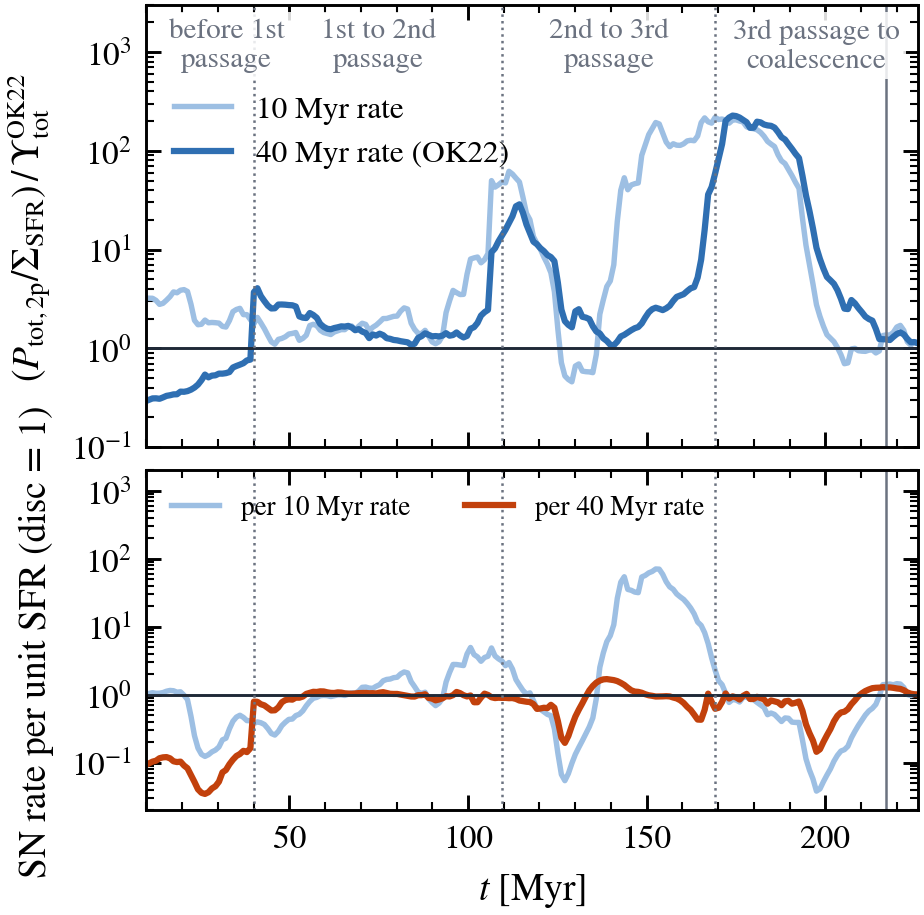

**Which component carries the excess.** x: time. y: $\sum_c P_{X,c}/\sum_c \Sigma_{{\rm SFR,40},c}/4.81\times10^3$ in
$\rm km\ s^{-1}$ over the clean layer columns, for $X$ = thermal, turbulent and Maxwell stress, against the OK22
thermal and turbulent yields (eqs. 26a and 26b) at the $\Sigma_{\rm gas,2p}$-weighted mean pressure of the same
snapshot. In units of the OK22 *total* yield the three components are 0.6, 0.9 and 0.1 in the discs, adding to 1.6, and
15, 116 and 27 from 167 to 195 Myr, adding to 167. Result: of the pressure that the layer holds per unit star
formation, the turbulent term carries 70 %, the Maxwell stress 16 % and the thermal term 9 %.

That is a statement about which component holds the pressure, not about what made the ratio rise, and the two should
not be confused. Between the discs and 167 to 195 Myr the mean values per column change as follows:

| | discs, 40 to 100 Myr | 167 to 195 Myr | factor |
|---|---|---|---|
| $P_{\rm th}$ in $\rm K\ cm^{-3}$ | 2270 | 1830 | 0.8 |
| $P_{\rm turb}$ | 3600 | 13600 | 3.8 |
| $\Pi_{\rm mag}$ | 245 | 4120 | 16.8 |
| $P_{\rm tot}$ | 6280 | 19500 | 3.1 |
| $\Sigma_{\rm SFR,40}$ in $\rm M_\odot\ yr^{-1}\ kpc^{-2}$ | 6.7e-4 | 4.6e-5 | 0.069 |

The yield rises by a factor 45, which is 3.1 from the pressure and 15 from the star formation rate; with the weak
pressure dependence of the OK22 yield the ratio to it rises by 57. So the dominant factor is that star formation
stopped, not that the pressure rose, and the thermal pressure did not rise at all. Consistently, no choice of
component rescues the OK22 star-formation relation there: fed the measured pressure, OK22 eq. 28a over-predicts the
rate by 90; fed $P_{\rm th} + \Pi_{\rm mag}$, by 23; fed $P_{\rm th}$ alone, by 6. In the discs the same relation fed
$P_{\rm tot}$ is right to within a factor 1.7.

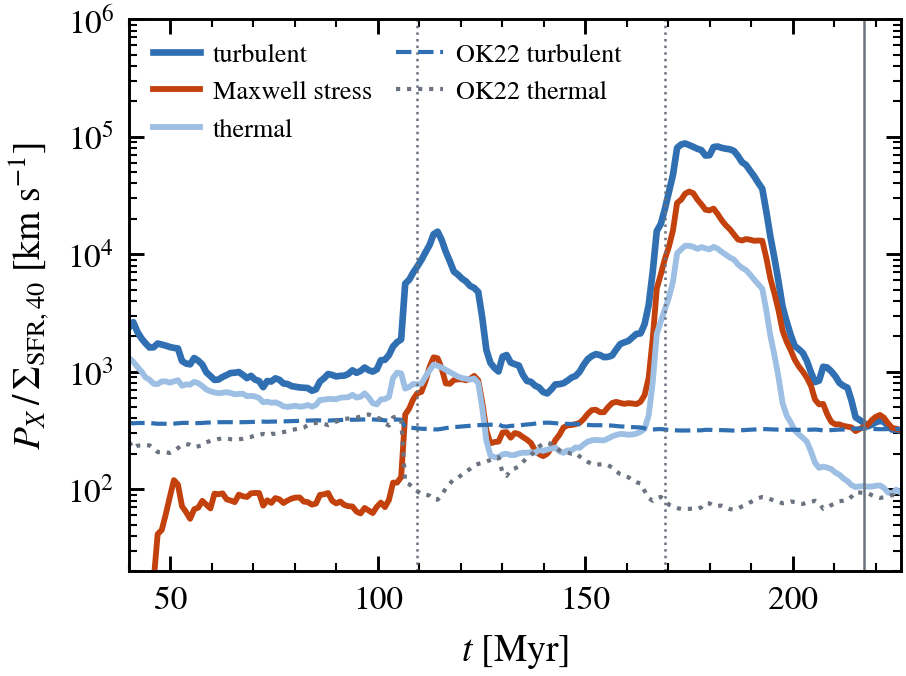

**It is not an area effect.** A natural reading of the collapse in $\Sigma_{\rm SFR}$ is that star formation switches
off over most of the galaxy while the surviving patches keep forming stars normally, so that the pressure averaged over
a largely quenched area is compared with a rate that only a few columns produce. The columns say otherwise. Splitting
the clean layer columns of each snapshot into those with $\Sigma_{\rm SFR,40} > 0$ and the rest:

| interval | fraction of columns forming stars | $\Sigma_{\rm SFR,40}$ in those columns | yield ratio, all columns | yield ratio, star-forming columns only |
|---|---|---|---|---|
| discs, 40 to 100 Myr | 0.63 | 1.1e-3 | 1.5 | 1.4 |
| 2nd passage, 107 to 125 | 0.56 | 5.3e-4 | 13 | 13 |
| 130 to 165 Myr | 0.67 | 2.1e-3 | 2.1 | 1.8 |
| 167 to 195 Myr | 0.43 | 9.8e-5 | 171 | 165 |
| after 200 Myr | 0.75 | 5.9e-3 | 1.9 | 1.9 |

The star-forming area falls only by a third, from 0.63 to 0.43 of the columns, while the rate inside the columns that
are still forming stars falls by a factor 12. Restricting the yield to those columns alone changes it from 171 to 165.
The columns that form stars in that interval are themselves at 165 times the OK22 yield, and their median pressure,
$1.1\times10^4$ $\rm K\ cm^{-3}$, is higher than in the discs. The suppression is in the rate per star-forming column,
not in the area over which star formation occurs.

**What supplies it instead.** x: time. y, as $\Sigma_{\rm gas}$-weighted medians over the clean layer columns: the
measured $P_{\rm tot}$ and $\mathcal W$; the pressure that PRFM feedback supports at the measured 40 Myr star formation
rate, i.e. the $P$ for which OK22 eq. 28a returns that rate, $P_{\rm fb} = 10^{(\log_{10}\Sigma_{\rm SFR,40} + 7.43)/1.18}$;
and the shear term $0.02\ \Sigma_{\rm gas} H S^2$ of Part B with $S$ the mass-weighted shear rate of the slab from the
velocity-gradient tensor. Result: in the discs feedback supports 0.45 of the measured pressure and the shear term is 3
times it; from 167 to 195 Myr feedback supports 0.013 of it and the shear term is 7 times it. The ordered flow carries
far more energy than the layer's turbulence needs, in the discs as in the merger, so the shear term is a statement
about availability, not a measured transfer rate. The mass-weighted shear rate itself rises from 550 to 1030
$\rm km\ s^{-1}\ kpc^{-1}$ between the discs and that interval, the vertical dispersion from 9.9 to 17.9
$\rm km\ s^{-1}$, and the magnetic share of the support from 0.03 to 0.22.

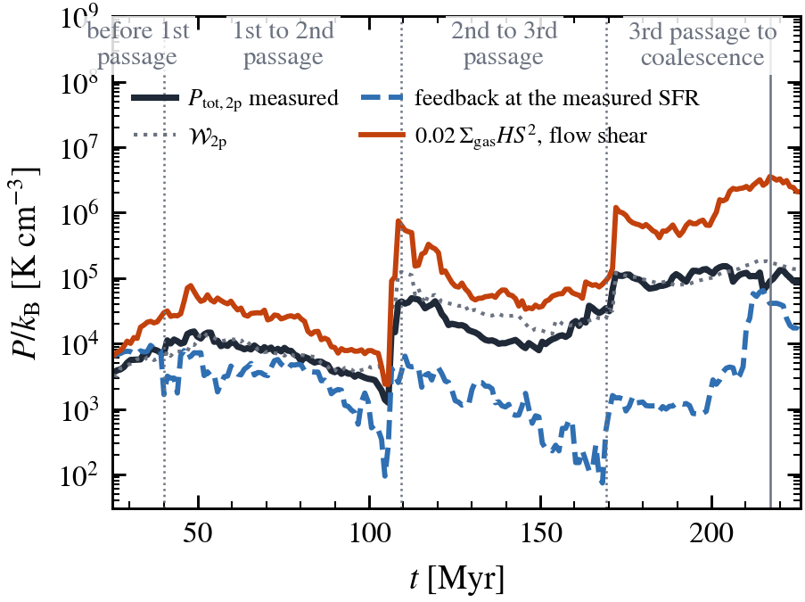

**The gas is not gone; it is unbound.** x: time. y, in solar masses: the gas mass of the clean layer columns
($\sum_c \Sigma_{{\rm gas},c} A$); the mass in dense clumps, the friends-of-friends groups above 100 $\rm cm^{-3}$ of
Part A; the part of that clump mass with $\alpha_{\rm tot} < 4$, the threshold of the efficiency step; and the stellar
mass formed in the preceding 10 Myr. Comparing the discs with the trough from 169 to 195 Myr:

| | discs, 40 to 100 Myr | trough, 169 to 195 Myr | factor |
|---|---|---|---|
| gas in the layer columns | 4.8e7 | 5.9e7 | 1.2 |
| mass in dense clumps | 8.5e5 | 2.2e6 | 2.6 |
| of those, $\alpha_{\rm tot} < 4$ | 4.9e5 | 2.4e4 | 0.05 |
| stars formed per 10 Myr | 8.3e4 | 4.9e3 | 0.06 |

There is more gas in the layer than in the discs, and 2.6 times more of it above 100 $\rm cm^{-3}$. What collapses is
the bound part: the mass of dense gas below the virial threshold falls by a factor 21, and the stellar mass formed
follows it by the same factor. The star formation rate is not suppressed by a lack of gas, by its removal, or by a
smaller star-forming area, but because the dense gas that is present is unbound, with a median $\alpha_{\rm tot}$ of
49 against 6 in the discs.

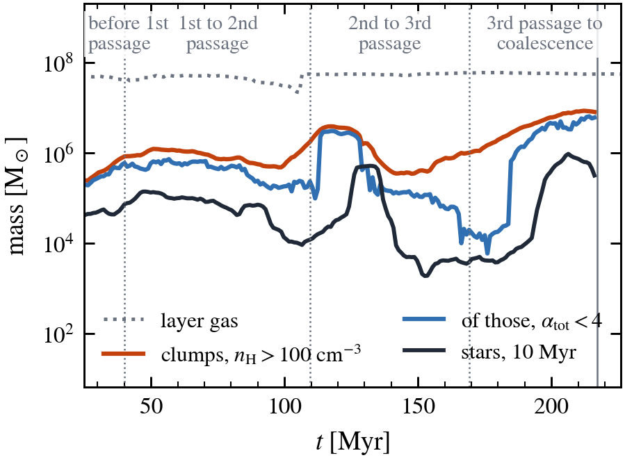

**What raises $\alpha_{\rm tot}$: the clump turbulence, not the field.** With
$\alpha_{\rm tot} = \frac{5\sigma_{\rm 3d}^2 r_h}{3GM}(1 + v_A^2/\sigma_{\rm 3d}^2)$, the median over the
$n_{\rm H} > 100$ clumps changes between the discs and the trough as follows:

| | discs | trough | factor | contribution to $\log\alpha_{\rm tot}$ |
|---|---|---|---|---|
| $\sigma_{\rm 3d}$ of the clump | 1.15 | 2.52 | 2.19 | +0.68 dex |
| $r_h$ | 2.59 pc | 3.24 pc | 1.25 | +0.10 dex |
| $M$ | 417 | 502 | 1.20 | −0.08 dex |
| $\alpha_{\rm vir}$ | 3.07 | 14.2 | 4.61 | +0.66 dex |
| $1 + v_A^2/\sigma_{\rm 3d}^2$ | 1.92 | 2.96 | 1.54 | +0.19 dex |
| $\alpha_{\rm tot}$ | 5.97 | 48.7 | 8.17 | +0.91 dex |

Three quarters of the rise is the clump velocity dispersion, which doubles; the magnetic factor adds a fifth of it, and
the changes in size and mass almost cancel. The clump dispersion doubles because the layer dispersion does: the
$\Sigma_{\rm gas}$-weighted median $\sigma_{\rm eff}$ goes from 9.9 to 17.9 $\rm km\ s^{-1}$ over the same interval, and
the cascade of link 4 hands that to the clumps at their own size. The mean clump density is unchanged, 163 against
150 $\rm cm^{-3}$, so this is not a density effect.

x: time. Top: the $\Sigma_{\rm gas}$-weighted median $\sigma_{\rm eff} = (P_{\rm tot}/\rho_{\rm mid})^{1/2}$ of the clean
layer columns and the median $\sigma_{\rm 3d}$ of the dense clumps of the same snapshot. Bottom: the median
$\alpha_{\rm tot}$ of those clumps, with the threshold of the efficiency step at 4 dashed, and on the right axis the
fraction of clump mass below it.

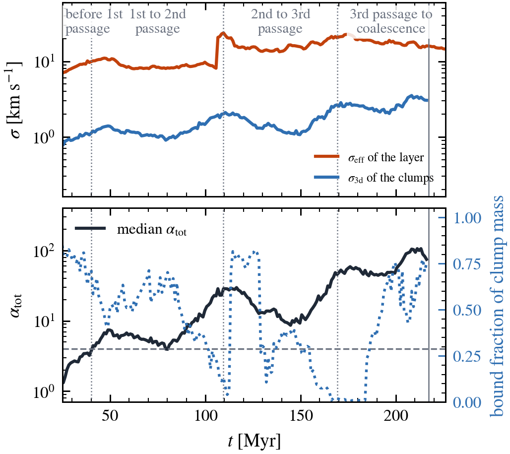

## Magnetic field
x: time. y: $B_c = (8\pi k_{\rm B} P_{{\rm mag},c})^{1/2}$ per layer column, in $\mu{\rm G}$. Dark:
$\sum_c \Sigma_{{\rm gas},c} B_c / \sum_c \Sigma_{{\rm gas},c}$ over the clean columns; light: the median of $B_c$.
Result: 10 nG seed, e-folding time 10 Myr, 1 to 2 microgauss from 50 Myr, a factor 5 jump at the second passage, 10 to 20
microgauss after the third.

## Pressure shares
x: time. y, per snapshot with $c$ over the clean layer columns: $\sum_c P_{{\rm th},c}/\sum_c P_{{\rm tot},c}$,
$\sum_c P_{{\rm turb},c}/\sum_c P_{{\rm tot},c}$ and $\sum_c \Pi_{{\rm mag},c}/\sum_c P_{{\rm tot},c}$, which sum to one;
dashed: $\sum_c P_{{\rm mag},c}/\sum_c P_{{\rm tot},c}$, the magnetic pressure $B^2/8\pi$ relative to the total support.
The dashed line is not part of the sum and can exceed one: $P_{\rm tot}$ contains the field only through the vertical
Maxwell stress $\Pi_{\rm mag} = (B^2 - 2B_n^2)/8\pi$, as in Ostriker & Kim (2022), which is at most $B^2/8\pi$ (one third
of it for an isotropic field), so the magnetic pressure can be larger than all of the vertical support together.
Result: the Maxwell stress is below 10 % of the support before the second passage, 10 to 25 % between the second and
third, and 20 to 45 % from the third passage to coalescence; the magnetic pressure itself is 0.3 to 0.5 of the total
support between the second and third passage, 0.8 after the third, and exceeds it from 200 Myr on, i.e. the field
reaches equipartition with the whole vertical support even though only part of it supports the layer.

## Clouds
*Clouds* and *clumps* are the friends-of-friends groups of cold gas defined above (l = 3 pc at n_H > 10 cm⁻³, l = 1.5 pc
at n_H > 100 cm⁻³, N ≥ 25), on every tenth snapshot, over the whole box.
Stars carry the ID of the gas particle they formed from, so the stars formed from a cloud's members are counted exactly.
Per cloud, with $M$, $\mathbf x_{\rm com}$, $\mathbf v_{\rm com}$, $r_h$ as defined above,

$$\sigma_{\rm 3d}^2 = \frac{\sum_i m_i|\mathbf v_i-\mathbf v_{\rm com}|^2}{M},\qquad
\alpha_{\rm vir} = \frac{5\ (\sigma_{\rm 3d}^2/3)\ r_h}{G\ M},\qquad
v_A^2 = \frac{1}{N}\sum_i \frac{B_i^2}{4\pi\rho_i}.$$

Cloud mass function. x: $M$. y: $N_k/(N_{\rm phase}\ \Delta M_k)$, the number of clouds in mass bin $k$ divided by the bin
width and by the total number of clouds in the phase; error $\sqrt{N_k}/(N_{\rm phase}\Delta M_k)$. Dashed: M^-1.6. Result: identical in all four phases
(maximum-likelihood index above 300 Msun 1.57 to 1.60); only the largest cloud grows, 3 × 10⁵ to 10⁷ Msun.

Efficiency. Clumps are linked from snapshot k to k+1 when each is the other's largest member overlap; a chain of such links
is a lineage. For a lineage with clumps at snapshots $k = k_0\ldots k_1$: $M_\star(k)$ = mass of stars formed between snapshots $k$
and $k+1$ whose parent gas particle was a member at $k$; $M_{\star,10}(k_1)$ = the same over the 10 Myr after $k_1$;

$$\epsilon_{\rm int} = \frac{\sum_{k < k_1} M_\star(k) + M_{\star,10}(k_1)}{\max_k M(k)}.$$

The pre-onset snapshot is the last k before M_*(k) > 0
(or k_0 if stars form at once). x: alpha_vir at the pre-onset snapshot. y: epsilon_int. Points: lineages with
max_k M(k) ≥ 300 Msun, k_0 after 5 Myr, k_1 before 221 Myr; lines: medians per alpha bin per phase, phase by onset time.
Result: about 5 % for alpha below 2 to 4, 0.1 % above 10; the fraction of clumps below the threshold falls from 0.9 to 0.06
across the run.

## Young stellar groups: what this run can and cannot say
The stars formed in the run are grouped with the friends-of-friends and energy criteria above. Every bound group, from
100 $\rm M_\odot$ to $4\times10^5$ $\rm M_\odot$, has a half-mass radius of 0.2 to 0.4 pc, which is the 0.4 pc softening, and
an age spread of 0.6 to 0.8 Myr; the clumps that produce them form stars for about 1 Myr. The stars therefore appear
where and when the star formation criterion of the code fires (density above 100 $\rm cm^{-3}$, self-gravitating,
$\epsilon_{\rm ff} = 0.5$ per free-fall time) and inherit the clustering of the gas at that scale. Whether such a group is a
bound cluster, how compact it is and whether it survives are set by that criterion and by the softened stellar dynamics,
here and in every galaxy-scale simulation of this kind, and are not reported as results. The fraction of star formation
in bound groups is shown below for completeness and is not used as a result. What the groups do record is the
stellar mass that each star-forming clump produced, and the figures after it are read as that: the distribution of the
masses of the star-forming events, and their largest value.

**Bound fraction of the stars formed.** x: time, every tenth snapshot. y: the mass in bound groups (energy criterion
above, 5 pc linking, whole box) above 300 (solid) or 1000 (dashed) $\rm M_\odot$ whose members fall in the age window,
divided by the mass of all stars formed in that window: windows 0 to 10 Myr (blue) and 20 to 50 Myr (orange). Snapshots
in which less than 2000 $\rm M_\odot$ formed in the window are skipped. Result: 0.6 to 0.9 whenever star formation is on,
in the discs as in the bursts, at either floor; it falls only when the window contains little star formation, so that
the few groups are below the floor, and for the 20 to 50 Myr window after 190 Myr, whose stars sit in the 20 pc merged
nucleus that its own stars do not bind. Lahén et al. (2020, 2025) and Hislop et al. (2021) find 10 to 60 % with the same
kind of run and criterion-dependent values; the level here follows from stars forming at $\epsilon_{\rm ff} = 0.5$ in
self-gravitating gas above 100 $\rm cm^{-3}$ with 0.4 pc softening, which makes every event a compact bound knot, and is
a property of that rule.

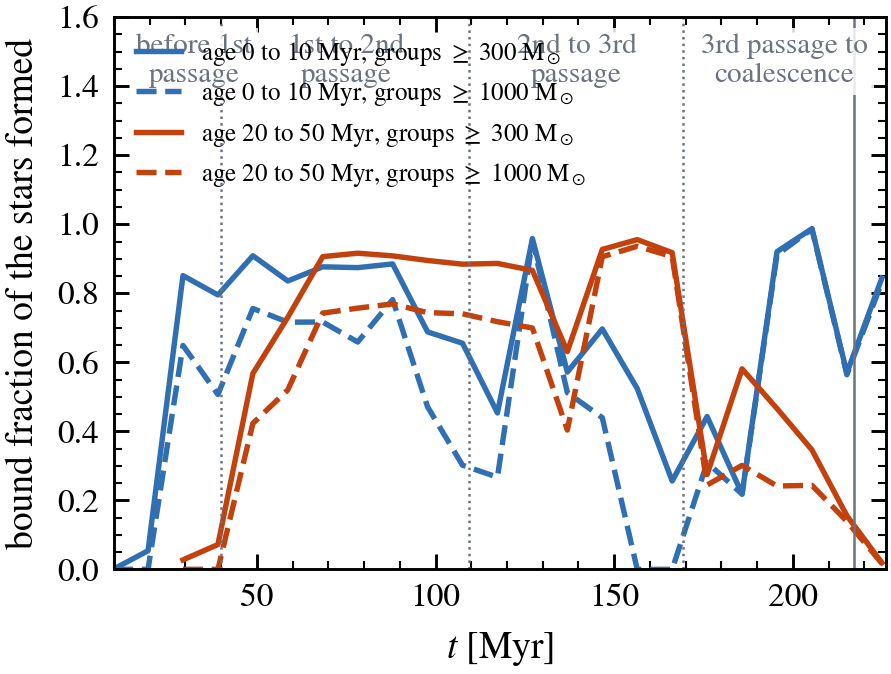

**Bound fraction against the environment.** The same quantity for the 0 to 10 Myr window (filled: groups above 300
$\rm M_\odot$; open: above 1000), one point per tenth snapshot from 25 Myr on, against the state of the clean columns of
that snapshot: $\Sigma_{\rm SFR,10}$ averaged over the columns that formed stars in the last 10 Myr (an observer's
star-forming area), and the $\Sigma_{\rm gas}$-weighted medians of the layer $P_{\rm tot}$, of
$\sigma_{\rm eff} = (P_{\rm tot}/\rho_{\rm mid})^{1/2}$ and of the layer $\mathcal W$. Dashed with band: the observed relation of Goddard et
al. (2010), $\Gamma = 0.29\ \Sigma_{\rm SFR}^{0.24}$, the plane in which Kruijssen (2012) tests his model. Result: no
correlation with the state of the layer. Spearman rank coefficients over the 21 snapshots: $-0.12$ against
$P_{\rm tot}$, $-0.20$ against $\mathcal W$, $-0.15$ against $\Sigma_{\rm gas}$ (all consistent with zero), $-0.50$
against $\sigma_{\rm eff}$. The one apparent trend, $+0.66$ against $\Sigma_{\rm SFR}$, is the mass floor: it is $+0.70$
against the stellar mass formed in the window, and among the 14 snapshots that formed more than $2\times10^4$
$\rm M_\odot$ it drops to $+0.36$ ($p = 0.2$), with pressure, dispersion and weight at $+0.15$, $+0.11$, $-0.09$. The
points lie 3 to 5 times above the observed relation at every $\Sigma_{\rm SFR}$. Read with the caveat above: in a run
of this kind the bound fraction is high wherever stars form and is not regulated by the layer.

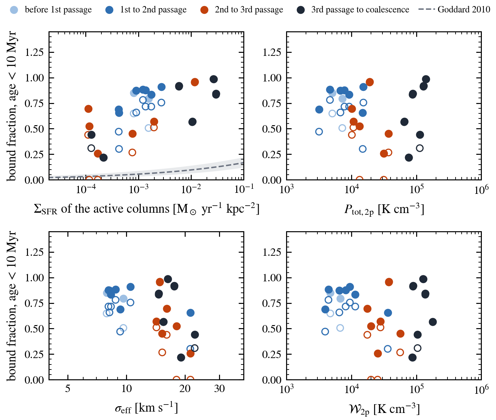

## Mass function of the young stellar groups
*Groups*: the friends-of-friends groups of stars younger than 10 Myr defined above (l = 5 pc, N ≥ 25), on every tenth
snapshot, kept if bound by the energy criterion above and lying in a clean column.
x: group mass. y: $N_k/\Delta\log M_k$ per phase, error $\sqrt{N_k}/\Delta\log M_k$. Lines: the maximum-likelihood
power law $dN/dM\propto M^{-\alpha}$ above 300 $\rm M_\odot$,

$$\alpha = 1 + \frac{N}{\sum_{M_i\ge300}\ln(M_i/300)},$$

drawn over the fitted range. Result: alpha = 1.92, 1.77, 1.68, 1.47; largest group 6.7 × 10³, 2.0 × 10⁴, 4.1 × 10⁵,
8.5 × 10⁵ Msun (the second-passage burst puts two thirds of its stars into one group of 4 × 10⁵ Msun and 1 pc half-mass
radius). Below 300 Msun after the second passage only a third of the groups are bound, so the function is quoted from
300 Msun up. Lahén et al. (2020) find the same slope (−1.67 above 300 Msun) and the same rise of the top with the burst in
their dwarf merger with a different code, so both are robust to the star formation prescription.

## Largest group per burst
x: $M_{{\rm young},c}$ of a full column $c$ (definition above). y: $M_{\max,c}$, the mass of the most massive bound
group whose centre lies in column $c$. Clean columns with M_young > 500 Msun and at least one bound group,
every tenth snapshot. Line: median of M_max per M_young bin; red: M_max = 0.5 M_young; dotted: M_max = M_young. Result:
the median follows half the young mass up to 3 × 10⁴ Msun; the columns of the pericentre bursts above 10⁵ Msun lie
between 0.5 and 1, i.e. most of a burst's stars are in its largest group.

## Every group against its column
Each bound group of the clean sample against the column it lies in (before the second passage the grid of its own galaxy,
after it the single merged grid). Left x: layer W_c. Middle x: layer P_tot,c. Right x: Sigma_SFR,10,c. y: group mass.
Dashed lines: $0.5\ \Sigma_{\rm SFR}(\mathcal W)\ A\ \tau$, $0.5\ \Sigma_{\rm SFR}(P)\ A\ \tau$ and
$0.5\ \Sigma_{\rm SFR,10}\ A\ \tau$ with the OK22 relations above, $A = 0.25$ $\rm kpc^2$ and $\tau = 10^7$ yr: half the stars a column forms in 10 Myr at the OK22 rate for its weight, for its
pressure, and at its own rate. Result: group masses fill two decades below the lines at every weight and pressure; only
the groups of the two pericentre bursts reach them.

## Line of sight
As the vertical-equilibrium figure with the column normal replaced by $\hat n_\theta = \cos\theta\ \hat n + \sin\theta\ \hat e_2$,
$\theta = 0, 30, 60, 90$ degrees, $\hat e_2$ the second in-plane axis of the grid. Each θ has its own full-column run and its own layer cut about the
midplane found along n̂_θ. y: the Sigma_gas-weighted median of layer P_tot / W over the columns, computed per grid and
combined over the two grids with weights equal to their column counts. Every fourth snapshot. Result: before the second
passage θ = 0 gives one and θ = 30 gives 0.4 to 0.7; between the second and third passage all θ give 0.6 to 1.2; after the
third all θ give 0.9 to 1.3.

## Column size
x: column depth $2z_{\rm col}$: 3 kpc (full column, about the grid plane) or 1, 0.5, 0.25 kpc ($z_{\rm col}$ = 0.5, 0.25,
0.125 kpc about the midplane of the 0.5 kpc reference column the point falls in). Marker: footprint side $L$ = 0.5, 0.25,
0.125 kpc (grids of $12^2$, $24^2$, $48^2$ columns over $\pm3$ kpc), $A = L^2$. y: for each configuration, the median over the snapshots of the phase (every
fourth snapshot) of r(t), the per-snapshot Sigma_gas-weighted median of P_tot / W. Shaded: 2H. Result: r depends on the
depth only; L from 0.5 to 0.125 kpc at fixed depth changes nothing, depths of 0.5 and 0.25 kpc give 1.5 and 2.7.

## Low-mass end of the group mass function
x: group mass bin $[M_1, M_2)$. y: the $\alpha$ maximising

$$\mathcal L(\alpha) = -\alpha\sum_i \ln M_i - N\ln\frac{M_1^{\ 1-\alpha} - M_2^{\ 1-\alpha}}{\alpha-1}$$

over the $N$ groups with $M_i$ in the bin, on a grid $\alpha = 0.2\ldots4$; error from the curvature of $\mathcal L$ at the
maximum. Filled: all friends-of-friends groups of the 10-particle catalogue (5 pc linking); open: bound ones only; per
phase, every tenth snapshot. Result: above 300 Msun bound and all agree within the errors; in the 100 to 300 Msun bin
after the second passage the bound-only index collapses because only a third of those groups are bound.

---
# Part B. The chain from the weight of the layer to the stellar mass of a clump

This part orders the measurements of Part A as a chain of six links, from the weight of the layer to the stars a clump
produces. For each link: the quantity carried, the relation in the form it would take in a theory, the figure that tests
it, and the verdict. Every constant is fitted to the run; this is the mathematical form of what Part A measures, not a
derivation. Part C lists what a derivation would have to supply.

Inputs per 0.5 kpc column: layer weight $\mathcal W$, midplane pressure $P_{\rm tot}$ and density $\rho_{\rm mid}$, scale
height $H$, effective dispersion $\sigma_{\rm eff} = (P_{\rm tot}/\rho_{\rm mid})^{1/2}$. Inputs per cold clump: mass $M$,
half-mass radius $r_h$, dispersion $\sigma_{\rm 3d}$, Alfvén speed $v_A$.

## Link 1. Weight to pressure
$P_{\rm tot} = \mathcal W$ (vertical balance), $\sigma_{\rm eff}^2 = P_{\rm tot}/\rho_{\rm mid}$.
Figures: vertical equilibrium, column size, line of sight (Part A). Verdict: **holds**. Layer $P_{\rm tot}/\mathcal W$ is
1.03, 0.94, 0.71, 0.85 in the four phases, never outside 0.5 to 2, for columns at least 1 kpc deep within 30 degrees of
the disc normal. The supply side does not hold: the pressure per unit star formation leaves the OK22 yield by 10 to 100
after the second passage because star formation collapses while the pressure stays at the weight (status table).

## Link 2. Turbulence to the density structure
$\sigma_s^2 = \ln\big(1 + b^2\mathcal M^2\ \beta/(\beta+1)\big)$ for the lognormal density PDF, with
$\mathcal M = \sigma_{\rm eff}/c_s$ and $\beta$ the plasma beta; the mass fraction above a density follows from it.
Figure: none yet. Verdict: **not tested**. The pressure shares give $\beta$ per column, and the density PDF per column is
one pass over the snapshots; the merger provides the test through the drop of $\beta$ at the second passage.

## Link 3. Density structure to the clump population
$n(M)\ {\rm d}M \propto M^{-1.6}\ {\rm d}M$ above 300 $\rm M_\odot$, with the top set by the largest unstable scale of the
layer, $M_{\rm top} \propto \sigma_{\rm eff}^4/(G^2\Sigma_{\rm gas})$ in an excursion-set picture.
Figure: cloud mass function (Part A). Verdict: **measured, not predicted**. The slope is the same in all four phases
(measured) and the top rises a hundredfold through the merger; whether the top follows $\sigma_{\rm eff}^4/(G^2\Sigma)$
phase by phase has not been checked.

## Link 4. Clump to its virial parameter, through the cascade of the layer
If a clump's dispersion is what the layer cascade gives at its size, $\sigma(r) = \sigma_{\rm eff}\ (r/H)^p$, then

$$\sigma_{\rm 3d} = \sigma_{\rm eff}\ (r_h/H)^p,\qquad
\alpha_{\rm tot} = \frac{5\ \sigma_{\rm eff}^2\ (r_h/H)^{2p}\ r_h}{3\ G\ M}\ \left(1 + \frac{v_A^2}{\sigma_{\rm 3d}^2}\right),$$

with no constant once $p$ is measured. Figure: below. x: $\sigma_{\rm eff}\ (r_h/H)^{1/2}$ of the full column containing
the clump at its pre-onset snapshot (definitions under Clouds); y: $\sigma_{\rm 3d}$ of the clump at that snapshot; one
point per star-forming lineage of the $n_{\rm H} > 100$ catalogue; dashed: equality. Verdict: **holds**, with $p = 0.65$
rather than 0.5. Over 1216 clumps and 2 dex in dispersion, 
$\log\sigma_{\rm 3d} = 0.34 + 0.89\log\sigma_{\rm eff} + 0.65\log(r_h/H)$
 with 0.20 dex scatter; at fixed $r_h/H$ the slope on $\sigma_{\rm eff}$ is 0.82 to 0.98, at fixed
$\sigma_{\rm eff}$ the exponent is 0.61 to 0.68, so neither variable carries the other. The median of
$\sigma_{\rm 3d}/[\sigma_{\rm eff}(r_h/H)^{1/2}]$ is 0.90, 0.93, 0.81, 1.08 in the four phases: the clumps formed in the
pericentre compressions sit on the same line as those of the quiet discs. This is the link the merger was expected to
break and does not.

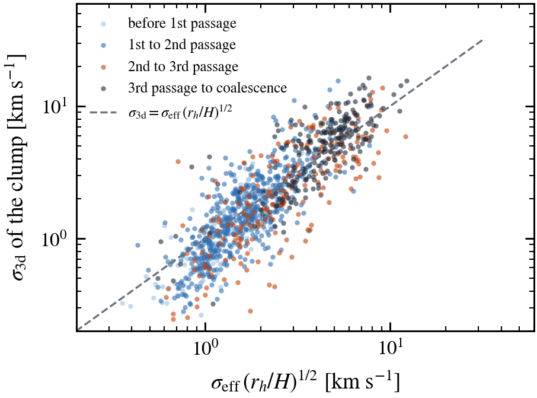

The same content in the older form, $\alpha_{\rm vir}$ of the clump against $\sigma_{\rm eff}$ of its column (left),
one relation for all phases with 0.2 dex offsets:

## Link 5. Virial parameter to efficiency
A step with lognormal scatter,

$$\epsilon(\alpha_{\rm tot}) = \epsilon_u + \frac{\epsilon_b - \epsilon_u}{1 + (\alpha_{\rm tot}/\alpha_c)^m},\qquad
\log\epsilon \sim \mathcal N\big(\log\epsilon(\alpha_{\rm tot}),\ s\big),$$

fitted by least absolute deviation in $\log\epsilon$ to the lineages (x:
$\alpha_{\rm tot} = \alpha_{\rm vir}(1 + v_A^2/\sigma_{\rm 3d}^2)$ at the pre-onset snapshot; y: $\epsilon_{\rm int}$; black: median per bin):

| parameter | dense clumps ($n_{\rm H} > 100$) | complexes ($n_{\rm H} > 10$) |
|---|---|---|
| $\epsilon_b$ (bound) | 0.050 | 0.028 |
| $\epsilon_u$ (unbound) | 0.0012 | 0.0004 |
| $\alpha_c$ | 4.0 | 5.9 |
| $m$ | 4.7 | 3.1 |
| $s$ (dex) | 0.69 | 0.71 |

Verdict: **fitted; the physical form is not tested**. The fraction of clumps below $\alpha_c$ is 0.91, 0.69, 0.37, 0.06
in the four phases and the median efficiency falls from 0.08 to 0.0014 accordingly, which the step reproduces (model
medians 0.050, 0.047, 0.0037, 0.0012). A one-constant form of the kind $\epsilon \propto \exp(-a\ \alpha^{1/2})$ from
the ratio of free-fall to dynamical time has not been tried on the same clumps. The 0.7 dex clump-to-clump scatter is
not explained. The integrated efficiency of 5 % is ten times below the $\epsilon_{\rm ff} = 0.5$ per free-fall time of
the star formation rule, so this level is set by feedback, not by the rule.

## The chain against the star formation rate
Links 3 to 5 together give the star formation rate from the clump population alone. Per snapshot, over the
$n_{\rm H} > 100$ clumps of the catalogue at that snapshot,

$${\rm SFR}_{\rm chain}(t) = \frac{1}{\tau}\sum_{\rm clumps}\epsilon(\alpha_{{\rm tot},i})\ M_i ,$$

with $\epsilon$ the step of link 5 (dense-clump constants), 
$\alpha_{{\rm tot},i} = \alpha_{{\rm vir},i}(1 + v_{A,i}^2/\sigma_{{\rm 3d},i}^2)$ from the clump's own catalogue entry, and $\tau$ one constant, the run-median of
$\sum\epsilon M/{\rm SFR}$ over $t > 25$ Myr, which comes out at 6.3 Myr, about the median clump lifetime. x: time. y:
the star formation rate of the run in 2 Myr bins from the stellar formation times (black) and $\rm SFR_{chain}$
(orange). Result: the two track each other over 2.5 dex with rank correlation 0.82 (0.86 with the measured rate 4 Myr
later) and 0.43 dex scatter; the phase medians of measured over chain are 1.8, 1.5, 0.5, 0.9. The chain reproduces the
collapse of star formation after the second-passage burst, when the clump mass is unchanged but the fraction of clump
mass below the step falls from 0.5 to 0.3, and it leads the bursts by a few Myr because the clumps are in place before
they form stars. It over-predicts the quiet interval by 2, which is the residual not accounted for. This is the
accounting for the yield excess of Part A: the pressure stays at the weight, the clumps stay in place, and the star
formation rate follows their $\alpha_{\rm tot}$, not the pressure.

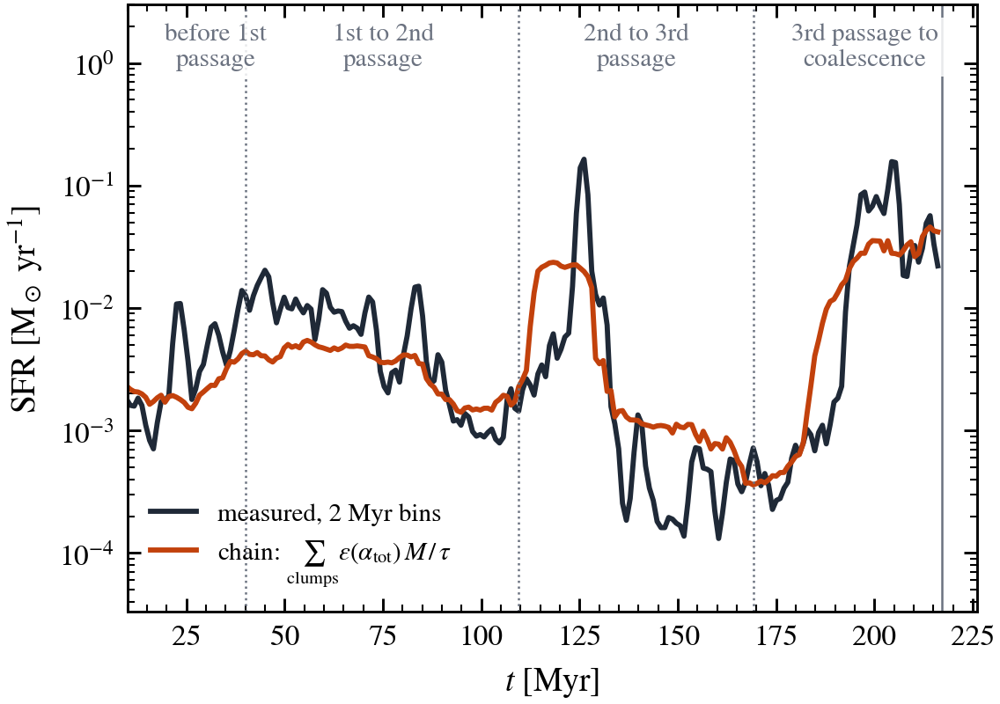

## Link 6. Clump to the stellar mass of the event
The mass side only. With the dominant group of a clump taking $f_c = 0.5$ of its stars (measured in the largest-group
figure of Part A), the mass function of the events is the clump mass function convolved with the efficiency
distribution of link 5:

$$n_{\rm ev}(M_{\rm ev}) = \int {\rm d}M\ n(M)\ \frac{1}{f_c M}\ p_\epsilon\left(\frac{M_{\rm ev}}{f_c M}\ \Big|\ \alpha_{\rm tot}(M)\right).$$

Evaluated on the measured clumps of each phase with their own $\alpha_{\rm tot}$ (200 draws), against the measured
groups:

| phase | fraction of clumps below $\alpha_c$ | slope pred. | slope meas. | top pred. | top meas. |
|---|---|---|---|---|---|
| before 1st passage | 0.63 | 2.32 ± 0.22 | 1.92 | 4.3e3 | 6.7e3 |
| 1st to 2nd passage | 0.32 | 2.18 ± 0.09 | 1.77 | 9.4e3 | 2.0e4 |
| 2nd to 3rd passage | 0.13 | 1.90 ± 0.10 | 1.68 | 1.4e5 | 4.1e5 |
| 3rd passage to coalescence | 0.01 | 1.64 ± 0.06 | 1.47 | 3.0e5 | 8.5e5 |

Verdict: **the shape is reproduced, the normalisation is not**. The flattening of the slope through the merger (0.68
predicted, 0.45 measured) and the rise of the top (70 predicted, 130 measured) both come out of the efficiency step
acting on a fixed clump population; the slope is 0.2 to 0.4 too steep in every phase and the top 2 to 3 times too low.
Whether the stars of an event form a bound cluster, its size, and its survival are set by the star formation criterion
and the softened dynamics (see the group section of Part A) and are not part of the chain.

## When the chain runs
The links above say how much a clump converts; they do not say when a column has clumps. Three measured descriptions of
the timing, all fitted to the same data they describe:

**Duty cycle.** x: layer $\mathcal W_c$ of a clean column. y: points, per 0.5 dex bin: the fraction of columns in the bin
with $M_{{\rm young},c} > 500$ $\rm M_\odot$; lines:

$$P(\mathcal W) = \left[1 + \exp\big(-k\ (\log_{10}\mathcal W - \log_{10}\mathcal W_{50})\big)\right]^{-1}$$

with $k$ and $\mathcal W_{50}$ by maximum likelihood over the columns of the phase. Result: the threshold moves by 1.2 dex
in $\mathcal W$ between the disc and the merger phases; the same fit against $\rho_{\rm mid}$ moves by less than 0.5 dex
(global fit $k = 6.0$, $\log\rho_{50} = -1.72$ in $\rm M_\odot\ pc^{-3}$), so the density, not the weight, decides
which columns form stars.

**Largest group and weight.** 25 Myr intervals. x: the 90th percentile of 
$\lbrace \mathcal W_c : M_{{\rm young},c} > 500\ {\rm M_\odot}\rbrace$ over the columns and snapshots of the interval; y: the largest bound-group mass in the interval.
Labels: interval start in Myr. Line: $0.5\ \Sigma_{\rm SFR}(\mathcal W)\ A\ \tau$ with the OK22 relation, $A = 0.25$
$\rm kpc^2$, $\tau = 10^7$ yr, nothing fitted. Open circle: the interval in which fewer than 5 % of the clean columns have
$M_{\rm young} > 500$. Result: the largest group rises with the weight of the active columns with 0.41 dex scatter
(log-log slope 1.4 over the seven active intervals); the two pericentre bursts lie 10 times above the PRFM line, the
quiescent interval 100 times below. This relation is not one to build on.

**Burst-mass distribution.** Phase 40 to 110 Myr. Black: $N_k/\Delta M_k$ over the bursting columns ($M_{\rm young} > 500$
$\rm M_\odot$) of the phase, all snapshots, error $\sqrt{N_k}/\Delta M_k$. Blue: 25 realisations of a null model:
every clean column of the phase bursts with probability $P(\mathcal W_c)$ from the logistic above; a bursting column gets
$M = 10^{\ a + b\log_{10}\mathcal W_c + s\ \xi}$, $\xi\sim N(0,1)$, with $b$ from a least-squares fit of $\log M_{\rm young}$
on $\log\mathcal W$ over the phase's bursts and $(a, s)$ from a lognormal likelihood truncated at 500 $\rm M_\odot$; masses
below 500 are dropped and the rest binned as the data. All ingredients are fitted to the same bursts, so the comparison
tests only whether the histogram contains structure beyond them. Result: it does not.

**Shear term.** Columns of the 18 snapshots with the turbulence decomposition (run on the two-frame grids), restricted
to $\Sigma_{\rm SFR,10} = 0$. A linear velocity field 
$\mathbf v(\mathbf x) = \mathbf v_0 + \mathsf G\ (\mathbf x - \mathbf x_0)$ is fitted by least squares to the gas of the column;

$$S = \left\Vert \tfrac12(\mathsf G + \mathsf G^{\rm T}) - \tfrac13\ {\rm tr}(\mathsf G)\ \mathsf I\right\Vert_F$$

is the shear rate in $\rm km\ s^{-1}\ kpc^{-1}$; $\sigma_{\rm tot}^2$ is the variance of $v_n$ over the column's gas and
$\sigma_{\rm res}^2$ the variance of $v_n$ after subtracting the fitted field. x: $\Sigma_{\rm gas} H S^2$ converted to
$\rm K\ cm^{-3}$. y: $P_{\rm turb}\ (\sigma_{\rm res}/\sigma_{\rm tot})^2$. Line: $y = 0.02\ x$. Result: one
coefficient in every phase, no offset. This is a description of where the turbulent pressure of the quiet columns sits
relative to the shear of the flow, not a derivation of it.

## What the chain gets and does not get
- Links 1, 4 and 5 hold as measured relations through the whole merger: the pressure is the weight, the clump
  dispersions are the layer cascade at the clump size, and the efficiency is a step in $\alpha_{\rm tot}$.
- Links 3 to 5 together give the star formation rate of the run from the clump population, over 2.5 dex with 0.4 dex
  scatter and one timescale, including its collapse after the bursts; this is what the failure of the yield relation
  reduces to.
- Link 6 reproduces the shape of the event mass function (flattening, rising top) from the clump population and the
  step, not its normalisation.
- Links 2 and 3 are untested and unpredicted respectively; the timing of the bursts is described, not explained.
- Not in the chain: the two efficiency levels themselves, the 0.7 dex clump-to-clump scatter, why the bound fraction of
  clumps falls from 0.9 to 0.06 through the merger, and anything about bound clusters.

---
# Part C. The theory one would want (does not exist)

A calculation that takes only the state of the layer, its weight, density, sound speed, field and what drives its
turbulence, and returns the mass function of the star-forming events, with the run used only to test it. In the terms
of Part B it has to supply, with no quantity read from the simulation:

1. **Link 2:** the density PDF of the layer from $\mathcal M$ and $\beta$, and its test against the measured PDF per
   column, including the drop of $\beta$ at the second passage.
2. **Link 3:** the clump mass function and its top from the fragmentation of the layer at the measured
   $\sigma_{\rm eff}$, $H$ and $\Sigma_{\rm gas}$ (excursion-set or equivalent), tested phase by phase against the
   measured slope 1.6 and the hundredfold rise of the top.
3. **Link 4:** the exponent $p = 0.65$ of the cascade from the driving of the layer turbulence, in place of the measured
   value.
4. **Link 5:** the two efficiency levels and the threshold $\alpha_c \approx 4$ from a collapse calculation with
   feedback, in place of the fitted step.
5. **Link 6, the part this run cannot supply at all:** whether the stars of an event stay bound, and at what size. That
   is decided below 0.1 pc while the stars decouple from the gas, needs individual stars forming from resolved
   collapse and collisional dynamics during formation, and is set by the star formation criterion in every galaxy-scale
   simulation of this type, ours and others'. The run hands over the inputs such a calculation needs per clump: $M$,
   $r_h$, $\sigma_{\rm 3d}$, $B$, $\alpha_{\rm tot}$, and $\sigma_{\rm eff}$, $H$ of its column.

What the run says such a calculation must reproduce: vertical balance through three pericentre passages with the yield
failing for the reason given; a magnetic share of the support rising from below 10 % to 20 to 45 %; an invariant clump
mass function of slope 1.6 with its top rising a hundredfold; clump dispersions $\sigma_{\rm eff}(r_h/H)^{0.65}$ with
0.2 dex scatter in every phase; a bound efficiency near 5 % and an unbound one near 0.1 % with the step at
$\alpha_{\rm tot} \approx 4$; and an event mass function that flattens from 1.92 to 1.47 while its top rises from
$7\times10^3$ to $8.5\times10^5$ $\rm M_\odot$.
