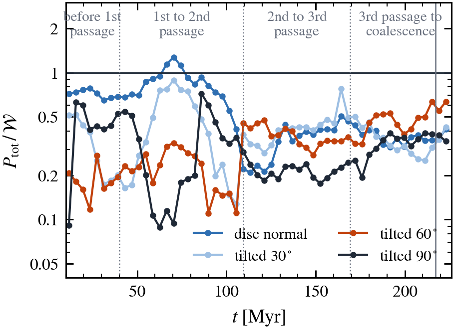
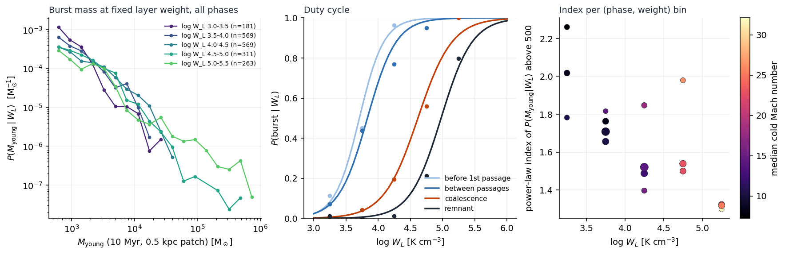

# merger_prfm

Does pressure-regulated, feedback-modulated star formation (PRFM; Ostriker & Kim 2022) survive a galaxy merger, and what does
it imply for the masses of the star clusters that form? These figures come from one high-resolution simulation of two
gas-rich dwarf galaxies merging (4 Msun gas and star particles, 0.4 pc softening, magnetic fields, resolved supernovae),
followed for 226 Myr through first passage, a second passage, coalescence and the settling of the remnant.

## The idea in one paragraph

PRFM says that in a galactic disc the midplane gas pressure adjusts to balance the weight of the gas column in the
gravitational field, and that star formation supplies that pressure through feedback: the weight sets the pressure, the
pressure sets the star formation rate. We test both halves in 0.5 kpc patches of the merger, then follow the consequences
downward in scale. The star formation rate of a patch is really a sequence of bursts; each burst is the collapse of a single
cold cloud; about half of each burst ends up in one star cluster. So the weight of the gas layer fixes how big the largest
star-forming event can be, and with it the top of the cluster mass function, while the slope of the mass function is set by
how efficiently clouds convert gas to stars, a quantity that the merger changes by an order of magnitude.

The figures are arranged along that chain: merger phases, equilibrium, pressure sources, clouds, clusters.

## Merger phases
Separation of the two nuclei with time. We split the run into four phases used in every other figure: before first passage,
between passages, coalescence (the first time the nuclei come within 0.5 kpc, solid line) and the remnant.

## Vertical equilibrium
The first half of PRFM: does the midplane pressure balance the weight? The ratio of total midplane pressure (thermal plus
turbulent plus magnetic stress) to weight is shown for two definitions of the weight. Using the full 3 kpc column, the
ratio drops to 0.3 after coalescence and the model looks broken. Restricting the weight to the gas within 0.5 kpc of the
midplane, where the star formation happens, the ratio stays at one to within 5 % in the disc phase and the remnant, and
falls only 20 to 35 % short during coalescence. The apparent failure is the dark-matter weight of tidal debris streaming
through the disc at 25 to 30 km/s, which is not a layer in any orientation and does not form stars.

## Pressure supplied by feedback
The second half of PRFM: is the pressure supplied by star formation? Using the feedback yields of Ostriker & Kim (2022) at
the local star formation rate, feedback accounts for 50 to 95 % of the pressure before coalescence but almost none of it
in the quiet intervals after. The gas is still in vertical balance then, so something else is supplying the pressure: the
large-scale flow of the merger. The regulation half of PRFM therefore holds only while star formation is on.

## Shear-driven turbulence
What supplies the pressure between bursts. For patches with no star formation in the last 10 Myr, the turbulent pressure
follows the shear-work term (gas surface density times scale height times the squared patch-scale shear rate) with one
coefficient of 0.02 in every phase and no offset. Feedback-only closures miss these patches by up to two orders of
magnitude. This is the missing term in the PRFM energy balance for a merger.

## Magnetic field
The field is seeded at 10 nG and amplified by the turbulence: it e-folds every 10 Myr, saturates near 1 microgauss by
50 Myr, jumps by a factor of five at coalescence and grows to 10 to 20 microgauss in the remnant, where the magnetic
pressure reaches equipartition with thermal plus turbulent pressure. It is treated as a measured contribution to the
vertical support, not modelled.

## Clouds
Stars keep the identity of the gas particle they formed from, so every young star can be traced to the cold cloud it came
from. Nearly all stars formed within 10 Myr of a snapshot come from gas already sitting in a cold cloud above 10 cm^-3,
and in 85 to 95 % of star-forming events a single cloud supplies essentially all the stars. A burst is the collapse of one
cloud.

The mass function of those clouds (T < 1000 K, n > 10 cm^-3, friends-of-friends at 3 pc) has a slope of 1.6 and does not
change through the merger. Only the most massive end grows, as the remnant assembles cold complexes of a million solar
masses and more.

What does change is how efficiently clouds turn gas into stars. The fraction of a cloud's mass converted within 10 Myr
rises with the cloud's mean density and drops fifteen-fold from the disc phase to the remnant, where the clouds are more
turbulent and less bound. Its scatter of 0.7 to 0.8 dex is what produces the 0.4 dex spread of burst masses at fixed
environment, and through it the slope of the cluster mass function. The physics of the slope lives here, at the cloud
scale, not in the disc-scale weight distribution.

---
## Not yet converted

Cluster mass function per merger phase. The slope above 300 Msun declines from 1.9 to 1.6 through the merger and the
largest cluster grows from 1e4 to 1.6e5 Msun.

Largest bound cluster against the young stellar mass of the same patch: one dominant cluster takes about half of each
burst.

Largest bound cluster formed per 25 Myr against the weight of the star-forming patches. Over a factor of 30 in weight the
largest cluster scales almost linearly with 0.1 dex scatter; the one quiescent interval sits 100 times below. The weight
sets the ceiling; the duty cycle decides whether it is reached.

Line-of-sight test: the pre-merger disc is an equilibrium layer only along its angular-momentum axis; after coalescence no
orientation makes the debris a layer.

Convergence of the low-mass end of the cluster mass function with the minimum group size, linking length and bound flag.

Burst mass at fixed weight (lognormal, 0.4 dex wide), the duty cycle per phase, and the running index per bin.

Mock built from the real patch weights, a density-threshold duty cycle and the lognormal kernel, against the observed
burst-mass distribution: the slope is reproduced in every phase, the top is not.

